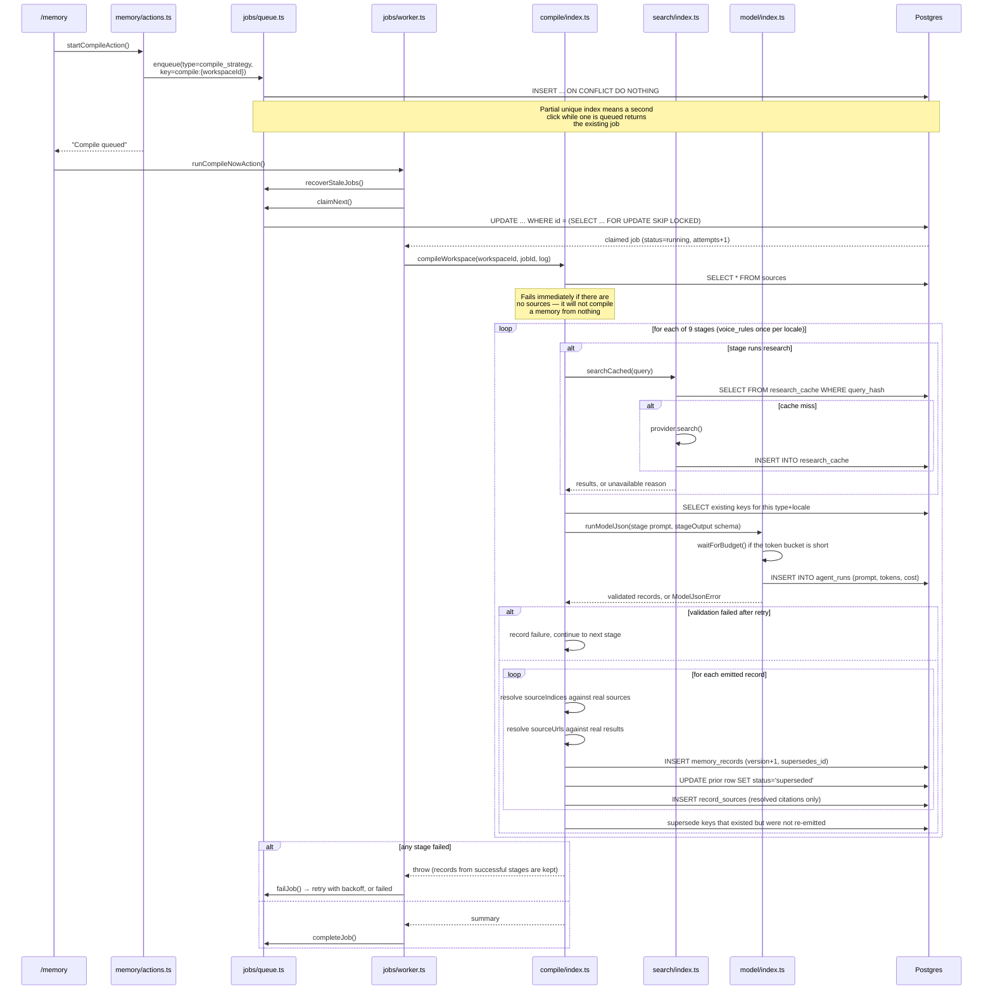
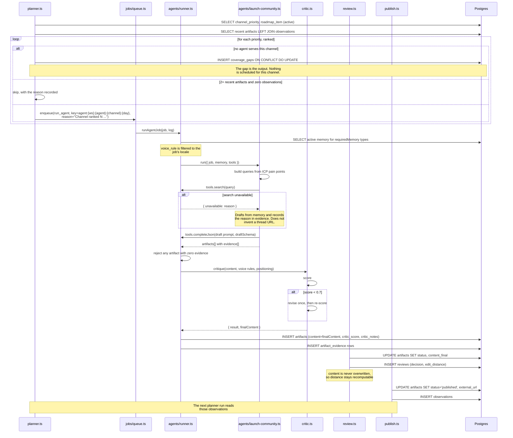

# 2. Architecture

## Module map

```
src/
├── app/                              Next.js App Router (all pages are server components)
│   ├── page.tsx                      Overview: health, live counts, phase list
│   ├── sources/                      Crawled pages; [id] shows extracted text
│   ├── memory/                       Records by type; [id] shows the version chain
│   ├── review/                       Review queue: content, evidence, critic, decisions
│   ├── planner/                      Priorities vs coverage, gaps, scheduled work
│   ├── publish/                      Copy-and-confirm, export, observation intake
│   ├── metrics/                      Edit distance chart, observations
│   │   └── chart.tsx                 Inline SVG line chart (client component)
│   ├── jobs/                         Queue table; [id] is the run inspector
│   ├── settings/                     BYOK key, provider, locales
│   ├── health/                       Health check UI
│   └── api/
│       ├── health/                   JSON health, 503 on failure
│       ├── worker/                   Queue drain; cron target
│       ├── artifacts/[id]/export/    Markdown export
│       ├── v1/                       REST: memory, artifacts, agents, observations
│       └── mcp/                      MCP server (JSON-RPC over HTTP)
└── lib/
    ├── db/
    │   ├── schema.ts                 Drizzle schema: 13 tables, 9 enums
    │   └── index.ts                  Lazy client with a retrying fetch
    ├── env.ts                        Zod-validated environment, lazy
    ├── crypto.ts                     AES-256-GCM envelope for BYOK keys
    ├── health.ts                     Environment, connectivity, migrations, crypto
    ├── workspace.ts                  Seed workspace, locales
    ├── settings.ts                   BYOK storage, key resolution
    ├── ingest/
    │   ├── fetch.ts                  User agent, timeouts, byte caps
    │   ├── robots.ts                 robots.txt fetch and policy
    │   ├── extract.ts                HTML → text, title, links, content hash
    │   └── crawl.ts                  Sitemap-first crawl, dedup by hash
    ├── compile/
    │   ├── stages.ts                 Nine stages: prompts, schema, normalisation
    │   └── index.ts                  The chain, provenance enforcement, supersede
    ├── memory.ts                     Read, edit, version, propagate staleness
    ├── agents/
    │   ├── registry.ts               Code-seeded agent definitions
    │   ├── types.ts                  ChannelAgent contract
    │   ├── runner.ts                 Memory slice, tools, persistence, critic
    │   ├── launch-community.ts       Community agent
    │   └── content.ts                Content agent
    ├── critic.ts                     Score, revise once, re-score
    ├── planner.ts                    Scheduling, coverage gaps
    ├── review.ts                     Decisions, edit distance, chart series
    ├── publish.ts                    Publish targets, export, observations
    ├── text.ts                       Normalised Levenshtein
    ├── model/
    │   ├── types.ts                  ModelProvider interface
    │   ├── index.ts                  Routing config, runModel, runModelJson
    │   ├── groq.ts                   Groq (OpenAI-compatible)
    │   ├── anthropic.ts              Anthropic (official SDK)
    │   ├── pricing.ts                Cost table
    │   └── ratelimit.ts              Token-bucket pacing from response headers
    ├── search/index.ts               SearchProvider + permanent cache
    ├── jobs/
    │   ├── queue.ts                  Enqueue, claim, complete, fail, recover
    │   ├── handlers.ts               Type registry with payload validation
    │   └── worker.ts                 Drain loop with caps
    └── api.ts                        Shared read/write surface for REST and MCP
```

### Dependency direction

`app/` depends on `lib/`. Nothing in `lib/` imports from `app/`. Within `lib/`,
the layering is:

```
jobs/handlers.ts ──┬──> compile/  ──┬──> model/  ──> settings.ts ──> crypto.ts
                   │                └──> search/          │
                   ├──> agents/runner ──> critic.ts ──────┘
                   └──> planner.ts ──> agents/registry.ts
                                   └──> jobs/queue.ts
```

`jobs/handlers.ts` is the single place where job types are bound to
implementations, so the worker never imports a domain module directly.

### Where the shared surface sits

[`src/lib/api.ts`](../src/lib/api.ts) exists so REST and MCP cannot drift. Both
`src/app/api/v1/*` and `src/app/api/mcp/route.ts` call the same functions; there
is no second implementation of "list artifacts" for the MCP path.

## Lifecycle 1: a compile run



### State at each step of a compile

| Step | Where state lives | Durable? |
|---|---|---|
| Compile requested | `jobs` row, status `queued` | Yes |
| Job claimed | same row, status `running`, `locked_at` set | Yes |
| Sources read | in memory, truncated to a 14,000-char budget | No |
| Search performed | `research_cache` row, keyed by query hash | Yes, permanently |
| Model called | `agent_runs` row with prompt, tokens, cost | Yes |
| Records emitted | `memory_records` + `record_sources` rows | Yes |
| Prior versions | same table, `status='superseded'` | Yes |
| Stage failures | accumulated in memory, thrown at the end | Surfaces on the `jobs.error` column |
| Compile finished | `jobs` row, status `done` | Yes |

Records are committed stage by stage. A compile that fails at stage seven leaves
the records from stages one to six in the database — see
[5 — The compile chain](05-compile-chain.md).

## Lifecycle 2: planner → draft → review → publish



### State at each step of a draft

| Step | Where state lives | Notes |
|---|---|---|
| Planner decision | `jobs.reason`, or a `coverage_gaps` row | The reason is written at enqueue time, not derived later |
| Memory slice | in memory only | Rebuilt per run from `memory_records` |
| Search results | `research_cache` | Shared with the compiler |
| Draft text | returned from the agent, not yet stored | |
| Critic score | in memory during `critique()` | |
| Persisted artifact | `artifacts.content` = post-critic text | The critic's revision is part of `content`, not `content_final` |
| Evidence | `artifact_evidence` rows | Written in the same call as the artifact |
| Human edit | `artifacts.content_final` | `content` untouched |
| Decision | `reviews` row with `edit_distance` | `edit_distance` is null unless the decision was an edit |
| Published | `artifacts.status`, `external_url`, `published_at` | Set only by a human action |
| Performance | `observations` rows | Read by the next planner run |

## Why the critic's revision lands in `content`

`content` is what the reviewer sees and what the edit distance is measured
against. If the critic's automatic revision were stored separately, the distance
would measure the human's change *plus* the critic's, which is not the metric
the dashboard claims to show. From
[`src/lib/agents/runner.ts`](../src/lib/agents/runner.ts):

```ts
// `content` is what the agent produced, after the critic's automatic
// revision. Human edits go to contentFinal so edit distance measures
// the human's change, not the critic's.
content: finalContent,
```
