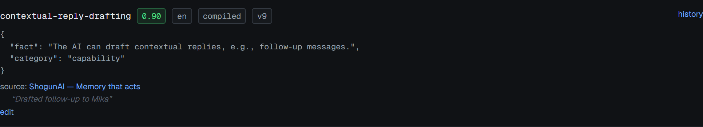
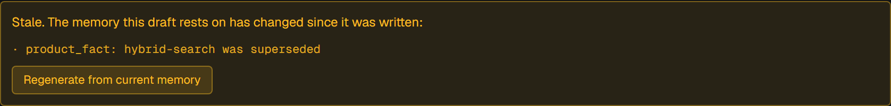
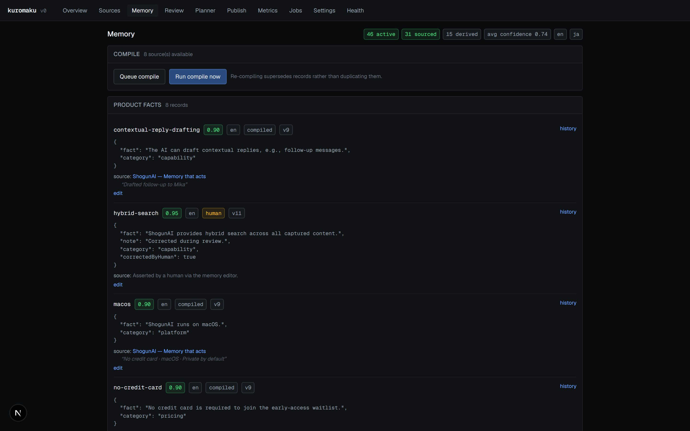

# 4. Memory semantics

This is the core of the system. Everything else is machinery around these rules.

Implementation: [`src/lib/memory.ts`](../src/lib/memory.ts) and
[`src/lib/compile/index.ts`](../src/lib/compile/index.ts).

## The shape of a record

A memory record is identified by the tuple `(workspace_id, type, key, locale)`.
`key` is the stable handle: it is what makes a later compile recognise "this is
the same fact, updated" rather than "this is a new fact".

Everything else — `value`, `confidence`, `version`, `status`, `origin` — is a
property of one *version* of that record.



Note the badge row: confidence, locale, origin and version. Below the JSON value
is the resolved source — a clickable link to the page it came from — and beneath
that, in quotes, the snippet the model cited as supporting text.

## Versioning and supersede

Records are append-only. Nothing is ever updated in place except the `status`
column of the row being retired.

Both write paths do the same three things in the same order:

1. Select the current `active` row for `(workspace_id, type, key, locale)`
2. Insert a new row with `version = prior.version + 1` and
   `supersedes_id = prior.id`
3. Update the prior row to `status = 'superseded'`

From `writeRecord` in [`src/lib/compile/index.ts`](../src/lib/compile/index.ts):

```ts
const [created] = await db
  .insert(memoryRecords)
  .values({
    workspaceId, type, key: emitted.key, value: emitted.value, locale,
    confidence,
    status: "active",
    version: prior ? prior.version + 1 : 1,
    supersedesId: prior?.id ?? null,
    origin: "compiled",
  })
  .returning();

if (prior) {
  await db
    .update(memoryRecords)
    .set({ status: "superseded" })
    .where(eq(memoryRecords.id, prior.id));
}
```

`editRecord` in [`src/lib/memory.ts`](../src/lib/memory.ts) is the same shape
with `origin: "human"`, plus one addition — it writes a `record_sources` row
recording the human assertion:

```ts
await db.insert(recordSources).values({
  recordId: created.id,
  sourceId: null,
  url: null,
  snippet: "Asserted by a human via the memory editor.",
});
```

That row matters: without it a human-edited record would count as *ungrounded*
and get a warning, which would be wrong. A human asserting something is a form of
provenance, just not a URL.

The full chain is browsable at `/memory/<id>`:


Note that the older versions are `superseded` with origin `compiled` and the
newest is `active`. Nothing was deleted: each compile run added a version, and a
human correction adds one the same way.

### Ordering hazard

Step 2 runs before step 3. Between them, two rows for the same key are `active`.
There is no transaction around the pair, because the Neon HTTP driver runs each
statement in its own implicit transaction. A concurrent read landing in that
window sees a duplicate. In practice compiles are serialised by the job queue —
one `compile_strategy` job can be active at a time — so the window is not
reachable through normal use, but it is a real gap and is listed in
[15 — Known limitations](15-known-limitations.md).

### `editRecord` refuses to edit a superseded row

```ts
if (prior.status !== "active") {
  throw new Error("Only the active version of a record can be edited");
}
```

Editing history would break the chain: two rows would claim the same
predecessor.

## Provenance enforcement

The model is asked to cite its sources, and it is not believed.

Each stage prompt gives the model a numbered list of sources and, for the
competitors stage, a numbered list of search results. The model returns
`sourceIndices` (integers into the source list) and `sourceUrls`. After the
model returns, [`src/lib/compile/index.ts`](../src/lib/compile/index.ts)
resolves every citation against what was actually in the prompt:

```ts
const citations: Array<{ sourceId?: string; url?: string; snippet?: string }> = [];

for (const idx of record.sourceIndices) {
  const source = sourceRows[idx];
  if (source) {
    citations.push({ sourceId: source.id, url: source.url, snippet: record.snippet });
  }
}
for (const url of record.sourceUrls) {
  if (searchResults.some((r) => r.url === url)) {
    citations.push({ url, snippet: record.snippet });
  }
}
```

Two properties follow:

- **A source index out of range resolves to `undefined` and is dropped.** If the
  model cites source 12 when it was given eight, that citation disappears.
- **A URL the model invented is dropped**, because it will not be found in
  `searchResults`.

### What happens to an unresolvable citation

The citation is discarded. **The record is not.**

This is the deliberate part. A record whose every citation fails to resolve is
still written, still visible, still usable — it simply carries no
`record_sources` rows. What that costs it depends on whether anything else
accounts for it, which is the subject of *Grounding* below: a record with
parents in the derivation graph is capped at its least confident parent, and one
with neither a citation nor a parent is capped at `0.4` and flagged in red.

The alternative — dropping the record — would silently lose information and make
the memory look cleaner than it is. The specification is explicit that a record
the model cannot source is emitted at low confidence and flagged, not dropped.


Note that there is no source line, because no crawled page states this. In its
place is `compiled from:` and the records it was built on, each a link. Following
one reaches a record that does cite a page.

### The cap is applied at write time, not display time

`writeRecord` computes the capped confidence before the insert. A record that
reaches the database ungrounded-and-confident is not possible through the
compiler. Verified end to end: across 46 active records, 31 sourced and 15
derived, no derived record exceeded the confidence of the least certain record
beneath it, and nothing was ungrounded at all.

## How confidence is assigned

Three inputs, applied in order:

1. **The model's own estimate.** The shared prompt preamble in
   [`src/lib/compile/stages.ts`](../src/lib/compile/stages.ts) asks for a
   calibrated number:

   > `"confidence"` is your honest read: 0.9+ when the material states it
   > plainly, 0.6-0.8 when it is a fair reading, below 0.5 when it is inference.

2. **A default when the model omits it.** The envelope normaliser substitutes
   `0.5`:

   ```ts
   /*
    * A model that omits confidence has told us nothing about how sure it is, so
    * 0.5 records exactly that — neither trusted nor dismissed. It is not a
    * fabricated measurement: an ungrounded record is still capped below 0.5 when
    * it is written, so nothing ungrounded can present as confident.
    */
   out.confidence = obj.confidence ?? 0.5;
   ```

3. **The grounding cap**, applied last, at write time — see *Grounding* below.

A human edit sets confidence explicitly through the editor form; the default
presented is the prior version's value.

## Grounding: three states, not two

A record accounts for itself in one of three ways, and `RecordWithSources`
reports which as `grounding`:

| state | meaning | confidence rule |
|---|---|---|
| `sourced` | at least one `record_sources` row — a crawled page, a search result, or a human assertion | keeps what the model gave it |
| `derived` | no source of its own, but incoming `record_derivations` edges | capped at the least confident parent |
| `ungrounded` | neither | capped at 0.4, flagged in red |

The middle state did not exist at first, and its absence was a real
misrepresentation. A positioning statement is not written on any page; the
compiler builds it from product facts and ICP segments, which is the shared
strategy layer working exactly as designed. Treating that as "unsourced"
alongside a genuine invention put fifteen fully accountable records behind a red
warning at 0.40 and told the reader the memory was far less grounded than it
was.

The cap on a derived record needs no chosen constant. It cannot be more certain
than its own foundation, so the number comes from the graph:

```ts
const parentFloor =
  parents.length > 0 ? Math.min(...parents.map((p) => p.confidence)) : null;

const confidence =
  citations.length > 0
    ? emitted.confidence
    : parentFloor !== null
      ? Math.min(emitted.confidence, parentFloor)
      : Math.min(emitted.confidence, 0.4);
```

`unsourced` survives as a boolean on the same type, and still means what it
always meant — nothing in the system accounts for this record — because the API
response, the MCP manifest and the golden set all assert on it. It is now true
only for `ungrounded`.

On the seeded workspace nothing is ungrounded: 31 records are sourced and 15 are
derived. The state is still reachable — `product_facts` is the one stage with no
dependencies, so an uncited fact there has nothing to fall back on — and
`eval/golden.ts` still asserts the rule for that stage.

## Staleness propagation

Staleness is computed at edit time. There is no background job and no scheduled
scan.

It runs in two steps: find every record downstream of the edit, then find every
artifact citing any of them.

```ts
const affected = await db.execute<{ id: string }>(sql`
  with recursive downstream(id, depth, path) as (
    select ${prior.id}::uuid, 0, array[${prior.id}::uuid]
    union all
    select rd.derived_record_id, d.depth + 1, d.path || rd.derived_record_id
    from ${recordDerivations} rd
    join downstream d on rd.source_record_id = d.id
    where d.depth < 16
      and not rd.derived_record_id = any(d.path)
  )
  select distinct id from downstream
`);

const affectedRecordIds = affected.rows.map((r) => r.id);

// Any artifact whose evidence cites the root or anything downstream of it.
const derived = await db
  .selectDistinct({ artifactId: artifactEvidence.artifactId })
  .from(artifactEvidence)
  .where(inArray(artifactEvidence.memoryRecordId, affectedRecordIds));
```

The root of the walk is `prior.id` — the row being *superseded*, not the new
one.

### Why the walk carries its path

The obvious formulation is `UNION` without the `path` column, on the reasoning
that `UNION` deduplicates and therefore terminates on a cycle. It does not
terminate usefully here. `UNION` deduplicates the whole **row**, and the row
includes `depth`, so a node reachable at three different depths produces three
distinct rows rather than one. In a derivation graph that is dense with
diamonds — a product fact feeding several ICP segments that all feed the same
positioning record — the row count multiplies at every level.

This was not theoretical. On a 199-edge graph the query stopped returning and
hung a screenshot capture run. Carrying the visited path and excluding any node
already on it makes each path visit a node at most once, and the same query
returns in under a second across 19 downstream records. The depth cap remains as
a second bound.

### Why `published` is excluded

The status filter admits `draft`, `approved` and `rejected`, and deliberately
omits `published`. A published artifact is live on some platform. Marking it
stale would claim the published thing changed, which it did not — what changed
is the memory it was derived from.

Instead, the evidence panel surfaces the change: `review.ts` computes
`staleEvidence` for every artifact regardless of status, by checking the status
of each cited record:

```ts
staleEvidence: mine.filter((e) => e.recordStatus === "superseded"),
```

So a published artifact keeps its status and still shows which of its
foundations moved.

### The banner names the record



Note it names the exact record — `icp_segment: founders` — rather than saying
"this draft is out of date". The reviewer can see precisely which fact changed
and click through to read the new version, and **Regenerate from current
memory** enqueues a fresh run of the same agent on the same channel.

### Propagation is transitive

An artifact goes stale when a record it cites is superseded, **or** when any
record upstream of what it cites is superseded. A product fact feeds positioning,
positioning feeds messaging pillars, and a draft citing a pillar rests on the
fact that changed.

That chain exists because the compiler records it. Every stage receives its
dependency records as prompt context, and every record a stage emits gets an edge
to every record in that slice — see
[`record_derivations`](03-data-model.md#record_derivations).

A one-hop rule would mark only the drafts citing the edited record and leave the
rest looking current, which is the defect this system exists to fix, reproduced
one level down.

### Reporting an indirect cause

An indirectly stale artifact cites records that are themselves still `active`, so
"which of my citations was superseded" answers *none*. The review layer therefore
walks *upward* from each cited record to find a superseded ancestor:

```sql
with recursive up(cited_id, id, depth, path) as (
  select m.id, m.id, 0, array[m.id] from memory_records m where m.id in (…)
  union all
  select u.cited_id, rd.source_record_id, u.depth + 1,
         u.path || rd.source_record_id
  from record_derivations rd
  join up u on rd.derived_record_id = u.id
  where u.depth < 16
    and not rd.source_record_id = any(u.path)
)
select distinct u.cited_id, m.id as root_id, m.key as root_key,
       m.type::text as root_type, u.depth
from up u join memory_records m on m.id = u.id
where m.status = 'superseded'
```

`hops` is how far up the change happened: `0` is a direct supersede, anything
higher is inherited. Causes are sorted nearest-first, because a direct supersede
is more useful to a reviewer than a four-hop ancestor.

They are also deduplicated per cited/root pair. The same diamond that made the
downstream walk expensive lets a reviewer reach one ancestor by paths of
different lengths, and the banner would otherwise list the identical cause twice
with different hop counts. Only the shortest path to each ancestor survives:

```ts
staleCauses: [
  ...causes
    .filter((c) => mineIds.has(c.citedRecordId))
    .sort((a, b) => a.hops - b.hops)
    .reduce((seen, c) => {
      const key = `${c.citedRecordId}:${c.rootId}`;
      if (!seen.has(key)) seen.set(key, c);
      return seen;
    }, new Map<string, StaleCause>())
    .values(),
],
```

## Reading the memory

`listActiveMemory` returns records with their sources attached and an
`unsourced` boolean already computed, so no caller has to remember the rule:

```ts
return rows.map((r) => {
  const s = byRecord.get(r.id) ?? [];
  return { ...r, sources: s, unsourced: s.length === 0 };
});
```

The same shape is what the REST and MCP surfaces return, so an external consumer
sees provenance and the unsourced flag without asking for them.



Note the header counts — active records, how many are unsourced, average
confidence, and the locales present — and that each type is its own panel with
its own unsourced count in the panel hint.
