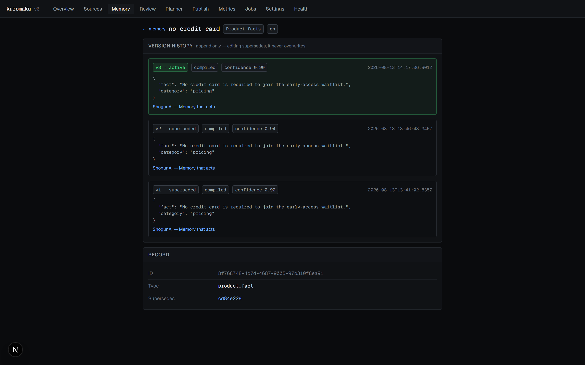
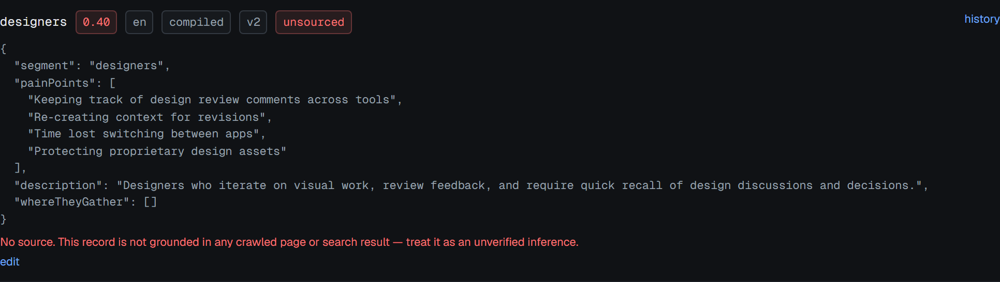

# 4. Memory semantics

This is the core of the system. Everything else is machinery around these rules.

Implementation: [`src/lib/memory.ts`](../src/lib/memory.ts) and
[`src/lib/compile/index.ts`](../src/lib/compile/index.ts).

## The shape of a record

A memory record is identified by the tuple `(workspace_id, type, key, locale)`.
`key` is the stable handle: it is what makes a later compile recognise "this is
the same fact, updated" rather than "this is a new fact".

Everything else — `value`, `confidence`, `version`, `status`, `origin` — is a
property of one *version* of that record.


Note the badge row: confidence `0.90`, locale `en`, origin `compiled`, version
`v3`. Below the JSON value is the resolved source — a clickable link to the page
it came from — and beneath that, in quotes, the snippet the model cited as
supporting text.

## Versioning and supersede

Records are append-only. Nothing is ever updated in place except the `status`
column of the row being retired.

Both write paths do the same three things in the same order:

1. Select the current `active` row for `(workspace_id, type, key, locale)`
2. Insert a new row with `version = prior.version + 1` and
   `supersedes_id = prior.id`
3. Update the prior row to `status = 'superseded'`

From `writeRecord` in [`src/lib/compile/index.ts`](../src/lib/compile/index.ts):

```ts
const [created] = await db
  .insert(memoryRecords)
  .values({
    workspaceId, type, key: emitted.key, value: emitted.value, locale,
    confidence,
    status: "active",
    version: prior ? prior.version + 1 : 1,
    supersedesId: prior?.id ?? null,
    origin: "compiled",
  })
  .returning();

if (prior) {
  await db
    .update(memoryRecords)
    .set({ status: "superseded" })
    .where(eq(memoryRecords.id, prior.id));
}
```

`editRecord` in [`src/lib/memory.ts`](../src/lib/memory.ts) is the same shape
with `origin: "human"`, plus one addition — it writes a `record_sources` row
recording the human assertion:

```ts
await db.insert(recordSources).values({
  recordId: created.id,
  sourceId: null,
  url: null,
  snippet: "Asserted by a human via the memory editor.",
});
```

That row matters: without it a human-edited record would count as *unsourced*
and get a warning, which would be wrong. A human asserting something is a form
of provenance, just not a URL.

The full chain is browsable at `/memory/<id>`:



Note that v1 and v2 are `superseded` with origin `compiled`, and v3 is `active`
with origin `human`. Nothing was deleted — the compiler produced two versions
over two compile runs, then a human correction produced the third.

### Ordering hazard

Step 2 runs before step 3. Between them, two rows for the same key are `active`.
There is no transaction around the pair, because the Neon HTTP driver runs each
statement in its own implicit transaction. A concurrent read landing in that
window sees a duplicate. In practice compiles are serialised by the job queue —
one `compile_strategy` job can be active at a time — so the window is not
reachable through normal use, but it is a real gap and is listed in
[15 — Known limitations](15-known-limitations.md).

### `editRecord` refuses to edit a superseded row

```ts
if (prior.status !== "active") {
  throw new Error("Only the active version of a record can be edited");
}
```

Editing history would break the chain: two rows would claim the same
predecessor.

## Provenance enforcement

The model is asked to cite its sources, and it is not believed.

Each stage prompt gives the model a numbered list of sources and, for the
competitors stage, a numbered list of search results. The model returns
`sourceIndices` (integers into the source list) and `sourceUrls`. After the
model returns, [`src/lib/compile/index.ts`](../src/lib/compile/index.ts)
resolves every citation against what was actually in the prompt:

```ts
const citations: Array<{ sourceId?: string; url?: string; snippet?: string }> = [];

for (const idx of record.sourceIndices) {
  const source = sourceRows[idx];
  if (source) {
    citations.push({ sourceId: source.id, url: source.url, snippet: record.snippet });
  }
}
for (const url of record.sourceUrls) {
  if (searchResults.some((r) => r.url === url)) {
    citations.push({ url, snippet: record.snippet });
  }
}
```

Two properties follow:

- **A source index out of range resolves to `undefined` and is dropped.** If the
  model cites source 12 when it was given eight, that citation disappears.
- **A URL the model invented is dropped**, because it will not be found in
  `searchResults`.

### What happens to an unresolvable citation

The citation is discarded. **The record is not.**

This is the deliberate part. A record whose every citation fails to resolve
becomes an unsourced record — it is still written, still visible, still usable,
but it carries no `record_sources` rows and its confidence is capped:

```ts
// Unsourced records are capped below 0.5 regardless of what the model claimed.
const confidence =
  citations.length === 0 ? Math.min(emitted.confidence, 0.4) : emitted.confidence;
```

The alternative — dropping the record — would silently lose information and make
the memory look cleaner than it is. The specification is explicit that a record
the model cannot source is emitted at low confidence and flagged, not dropped.



Note the `unsourced` badge in the header row and the warning underneath: *"No
source. This record is not grounded in any crawled page or search result — treat
it as an unverified inference."* The confidence badge reads `0.40`, which is the
cap, not a value the model chose.

### The cap is applied at write time, not display time

`writeRecord` computes the capped confidence before the insert. A record that
reaches the database unsourced-and-confident is not possible through the
compiler. This was verified end to end — across 48 active records with 18
unsourced, the maximum confidence among the unsourced set was exactly `0.40`.

## How confidence is assigned

Three inputs, applied in order:

1. **The model's own estimate.** The shared prompt preamble in
   [`src/lib/compile/stages.ts`](../src/lib/compile/stages.ts) asks for a
   calibrated number:

   > `"confidence"` is your honest read: 0.9+ when the material states it
   > plainly, 0.6-0.8 when it is a fair reading, below 0.5 when it is inference.

2. **A default when the model omits it.** The envelope normaliser substitutes
   `0.5`:

   ```ts
   /*
    * A model that omits confidence has told us nothing about how sure it is, so
    * 0.5 records exactly that — neither trusted nor dismissed. It is not a
    * fabricated measurement: an unsourced record is still capped below 0.5 when
    * it is written, so nothing unsourced can present as confident.
    */
   out.confidence = obj.confidence ?? 0.5;
   ```

3. **The unsourced cap**, applied last, at write time.

A human edit sets confidence explicitly through the editor form; the default
presented is the prior version's value.

## Staleness propagation

Staleness is computed at edit time by walking `artifact_evidence`. There is no
background job and no scheduled scan.

From `editRecord`:

```ts
// Staleness propagation: anything whose evidence cites the superseded record.
const derived = await db
  .selectDistinct({ artifactId: artifactEvidence.artifactId })
  .from(artifactEvidence)
  .where(eq(artifactEvidence.memoryRecordId, prior.id));

const staleArtifactIds = derived.map((d) => d.artifactId);

if (staleArtifactIds.length > 0) {
  await db
    .update(artifacts)
    .set({ status: "stale" })
    .where(
      and(
        inArray(artifacts.id, staleArtifactIds),
        inArray(artifacts.status, ["draft", "approved", "rejected"]),
      ),
    );
}
```

Note the id being matched is `prior.id` — the row being *superseded*, not the
new one. Evidence pointing at the old version is what makes an artifact stale.

### Why `published` is excluded

The status filter admits `draft`, `approved` and `rejected`, and deliberately
omits `published`. A published artifact is live on some platform. Marking it
stale would claim the published thing changed, which it did not — what changed
is the memory it was derived from.

Instead, the evidence panel surfaces the change: `review.ts` computes
`staleEvidence` for every artifact regardless of status, by checking the status
of each cited record:

```ts
staleEvidence: mine.filter((e) => e.recordStatus === "superseded"),
```

So a published artifact keeps its status and still shows which of its
foundations moved.

### The banner names the record


Note it names the exact record — `icp_segment: founders` — rather than saying
"this draft is out of date". The reviewer can see precisely which fact changed
and click through to read the new version, and **Regenerate from current
memory** enqueues a fresh run of the same agent on the same channel.

### Propagation is one hop

An artifact goes stale when a record it *directly* cites is superseded. There is
no transitive rule: memory records do not derive from each other in the data
model, so there is no chain to walk. The compiler passes earlier records into
later stages as prompt context, which means a positioning record is *influenced*
by product facts, but that influence is not recorded as an edge. Editing a
product fact therefore does **not** mark positioning records stale.

This is a real limitation, not a design subtlety — see
[15 — Known limitations](15-known-limitations.md).

## Reading the memory

`listActiveMemory` returns records with their sources attached and an
`unsourced` boolean already computed, so no caller has to remember the rule:

```ts
return rows.map((r) => {
  const s = byRecord.get(r.id) ?? [];
  return { ...r, sources: s, unsourced: s.length === 0 };
});
```

The same shape is what the REST and MCP surfaces return, so an external consumer
sees provenance and the unsourced flag without asking for them.


Note the header counts — active records, how many are unsourced, average
confidence, and the locales present — and that each type is its own panel with
its own unsourced count in the panel hint.
