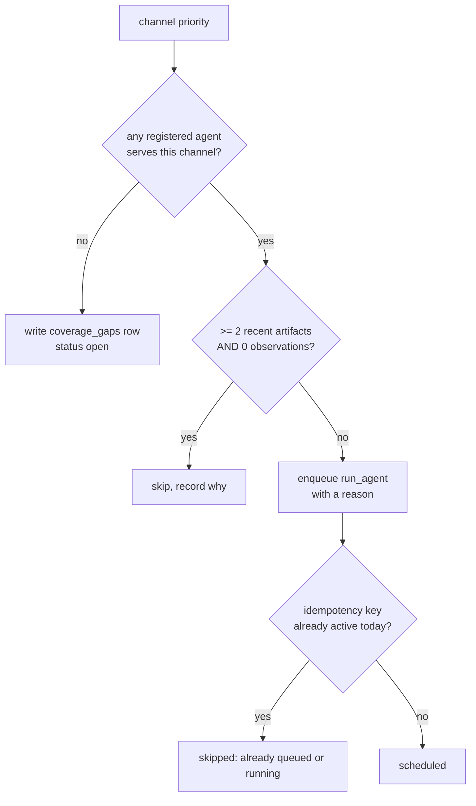
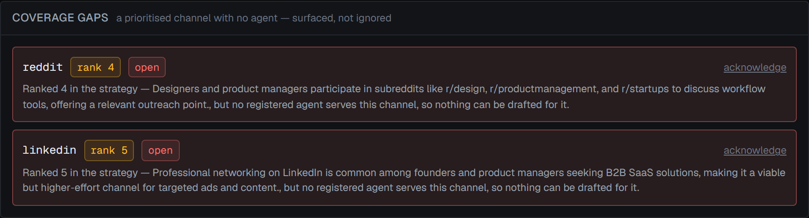
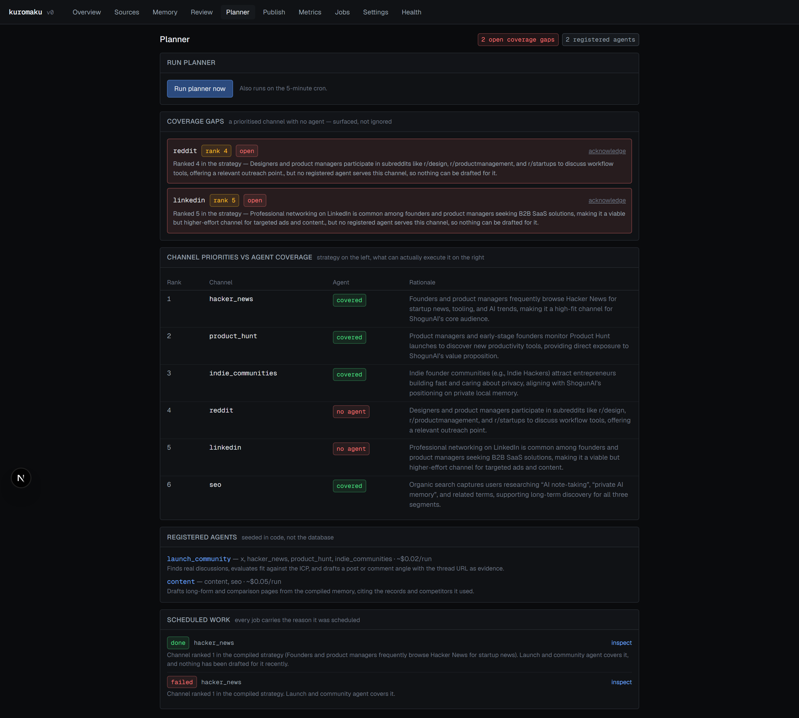
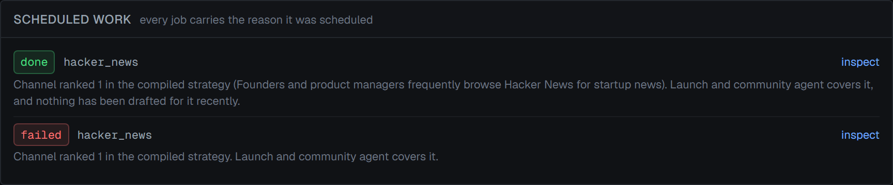

# 7. Planner

Implementation: [`src/lib/planner.ts`](../src/lib/planner.ts). Job type
`run_planner`. Runs on demand from `/planner` and on the 5-minute cron via
`/api/worker`.

## Inputs

Four reads, all scoped to the workspace:

| Input | Query |
|---|---|
| Channel priorities | `memory_records` where `type = 'channel_priority'` and `status = 'active'` |
| Roadmap items | `memory_records` where `type = 'roadmap_item'` and `status = 'active'` |
| Recent artifact history | `artifacts` created within 14 days, left-joined to `observations`, grouped by channel |
| Observation count | `observations` within the same 14-day window |

```ts
const RECENT_WINDOW_DAYS = 14;
```

The artifact query is the one that closes the loop:

```ts
const recent = await db
  .select({
    channel: artifacts.channel,
    total: sql<number>`count(*)::int`,
    observed: sql<number>`count(distinct ${observations.artifactId})::int`,
  })
  .from(artifacts)
  .leftJoin(observations, eq(observations.artifactId, artifacts.id))
  .where(and(eq(artifacts.workspaceId, workspaceId), gte(artifacts.createdAt, since)))
  .groupBy(artifacts.channel);
```

`total` counts recent artifacts per channel; `observed` counts how many of them
have any observation. The gap between those two numbers is what gates
scheduling.

### Early exit

With no channel priorities the planner does nothing and says so:

```ts
if (priorities.length === 0) {
  log("no channel priorities in memory — compile the strategy first");
  return { scheduled: [], gaps: [], skipped: [], observationsConsidered: 0, roadmapItemsConsidered: 0 };
}
```

## Channel slug normalisation

A priority record's channel comes from `value.channel`, falling back to the
record `key`, then normalised:

```ts
channel: (v.channel ?? p.key).toLowerCase().replace(/\s+/g, "_"),
```

This matters because the slug is matched against `AgentDefinition.channels`. A
compiled priority of `"Hacker News"` becomes `hacker_news` and matches; a
compiled priority of `"HN"` does not, and becomes a coverage gap for a channel
no agent will ever serve. The prompt constrains the model to a fixed slug list
for exactly this reason — see [5](05-compile-chain.md).

Priorities are then sorted by rank, unranked last:

```ts
.sort((a, b) => (a.rank ?? 99) - (b.rank ?? 99));
```

## Scheduling rules

For each priority, in rank order, exactly one of three outcomes:



### Rule 1 — no agent means a coverage gap

```ts
const agents = agentsForChannel(entry.channel);

if (agents.length === 0) {
  const rationale =
    `Ranked ${entry.rank ?? "unranked"} in the strategy${entry.rationale ? ` — ${entry.rationale}` : ""}, ` +
    `but no registered agent serves this channel, so nothing can be drafted for it.`;

  await db.insert(coverageGaps).values({...})
    .onConflictDoUpdate({
      target: [coverageGaps.workspaceId, coverageGaps.channel],
      set: { priorityRank: entry.rank, rationale },
    });
  ...
  continue;
}
```

The `continue` is the important line: a gap produces **no job**. The channel is
not attempted and not silently dropped — it becomes a row someone has to look
at.

`ON CONFLICT DO UPDATE` refreshes rank and rationale on every run without
resetting `status`, so acknowledging a gap survives subsequent planner runs
while still keeping the rank current.



Note both entries carry the rank the strategy assigned and a sentence explaining
that no agent serves the channel. These are real: the compiler ranked `reddit`
fourth and `linkedin` fifth, and the registry contains neither.

The same comparison is shown as a table, strategy on the left and executable
coverage on the right:



Note the `covered` / `no agent` column — it is computed from
`coveredChannels()` over the registry, so it changes the moment an agent is
registered, without a migration or a re-compile.

### Rule 2 — an unobserved channel stops being scheduled

```ts
const recentStats = recentByChannel.get(entry.channel);
if (recentStats && recentStats.total >= 2 && recentStats.observed === 0) {
  const why =
    `${recentStats.total} artifact(s) in the last ${RECENT_WINDOW_DAYS} days and no observations recorded ` +
    `for any of them. Record performance for this channel before drafting more.`;
  result.skipped.push({ channel: entry.channel, why });
  continue;
}
```

Both conditions are required. A channel with one recent artifact is not gated —
one draft is not evidence of a pattern. A channel whose artifacts have *any*
observation is not gated, regardless of what the observation says: the rule is
about whether anyone is measuring, not about whether the numbers were good.

This is the mechanism that makes performance an input to planning rather than a
report. It was verified end to end: with two unobserved `product_hunt`
artifacts present, the planner skipped that channel with exactly the message
above.

### Rule 3 — otherwise, schedule with a reason

```ts
const reason =
  `Channel ranked ${entry.rank ?? "unranked"} in the compiled strategy` +
  `${entry.rationale ? ` (${entry.rationale})` : ""}. ` +
  `${agent.displayName} covers it` +
  `${recentStats ? `, and ${recentStats.observed} of ${recentStats.total} recent artifact(s) here have observations` : ", and nothing has been drafted for it recently"}.`;
```

The reason is assembled from three facts the planner already has: the rank and
rationale from the compiled priority, the agent that covers the channel, and the
observation ratio. It is written to `jobs.reason` at enqueue time — it is stored
data, not a string regenerated for display.



Note the reason quotes the compiled rationale verbatim ("Founders and product
managers frequently browse Hacker News for startup news…"), so the chain from
strategy to scheduled work is readable without opening the memory browser.

When several agents serve a channel, the first in registry order wins:

```ts
const agent = agents[0];
```

There is no load balancing or capability matching. Registry order is the tie
break.

### The idempotency key

```ts
const day = new Date().toISOString().slice(0, 10);
const { job, created } = await enqueue({
  ...
  idempotencyKey: `agent:${workspaceId}:${agent.id}:${entry.channel}:${day}`,
});
```

Day-bucketed. Running the planner repeatedly within a day does not pile up
duplicate work for the same channel; the second attempt returns the existing job
and is recorded under `skipped` rather than `scheduled`.

The consequence is that the planner schedules **at most one job per agent per
channel per calendar day**, in UTC. A deliberate re-plan tomorrow works; a
deliberate re-plan an hour later does not.

## Roadmap items

```ts
for (const item of roadmap) {
  const channel = (v.channel ?? "").toLowerCase().replace(/\s+/g, "_");
  const agents = agentsForChannel(channel);
  if (agents.length === 0) continue;

  const reason = `Roadmap item "${v.title ?? item.key}": ${v.description ?? "no description"}`;
  const { job, created } = await enqueue({
    ...
    idempotencyKey: `roadmap:${workspaceId}:${item.key}`,
    payload: { agentId: agents[0].id, channel, locale: "en", roadmapKey: item.key },
  });
}
```

The key is **not** day-bucketed. A roadmap item produces one job for its
lifetime, which is what makes the roadmap executable rather than a recurring
nag: once the job exists, later planner runs return it rather than creating
another.

Two behaviours worth knowing:

- A roadmap item whose channel has no agent is skipped with `continue` and
  **does not** create a coverage gap. Only channel priorities do. That is an
  inconsistency — see [15](15-known-limitations.md).
- The observation gate does not apply to roadmap items. A roadmap item is
  scheduled even in a channel that has been gated.

## What the planner returns

```ts
export type PlanResult = {
  scheduled: Array<{ channel; agentId; reason; jobId }>;
  gaps: Array<{ channel; rank; rationale }>;
  skipped: Array<{ channel; why }>;
  observationsConsidered: number;
  roadmapItemsConsidered: number;
};
```

`scheduled` counts only jobs that were actually created. A channel whose job
already existed lands in `skipped`, not `scheduled` — which is correct, but it
means a planner run over an already-planned day legitimately reports zero
scheduled. This tripped a verification check during development until the test
cleared prior jobs first.

The result is returned to the caller and logged to the job. It is **not
persisted** beyond the `jobs.reason` column and the `coverage_gaps` rows.

## What the planner does not do

- It does not cancel or reprioritise existing queued work.
- It does not consider `estimatedCostUsd` or any budget.
- It does not read critic scores or edit distances — a channel producing badly
  received drafts is treated the same as one producing good ones, as long as
  someone is recording observations.
- It does not consider locale. Every job it schedules is `locale: "en"`,
  hard-coded, even in a workspace declaring more.
