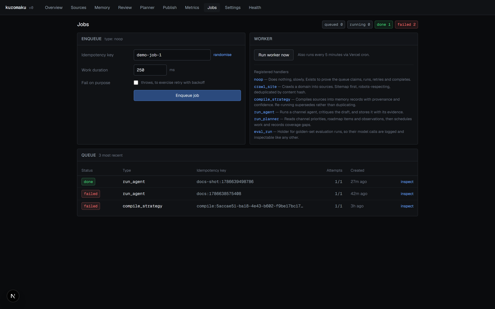
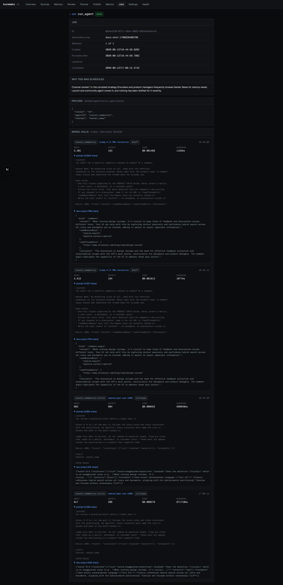

# 8. Jobs and the queue

Queue: [`src/lib/jobs/queue.ts`](../src/lib/jobs/queue.ts).
Handler registry: [`src/lib/jobs/handlers.ts`](../src/lib/jobs/handlers.ts).
Worker: [`src/lib/jobs/worker.ts`](../src/lib/jobs/worker.ts).
HTTP entry point: [`src/app/api/worker/route.ts`](../src/app/api/worker/route.ts).

A `jobs` table and a worker route. No third-party queue service.

## Claim semantics

Claiming is **one statement**, not a transaction:

```ts
const [claimed] = await db
  .update(jobs)
  .set({
    status: "running",
    lockedAt: new Date(),
    attempts: sql`${jobs.attempts} + 1`,
  })
  .where(
    sql`${jobs.id} = (
      select id from ${jobs}
      where status = 'queued' and run_after <= now()
      order by run_after asc, created_at asc
      for update skip locked
      limit 1
    )`,
  )
  .returning();
```

The reason is in the module header:

```ts
/**
 * Claiming is a single atomic statement rather than a transaction, because the
 * Neon HTTP driver runs every statement in its own implicit transaction — a
 * bare `SELECT … FOR UPDATE SKIP LOCKED` would release its lock before the
 * follow-up UPDATE ran, and two workers could claim the same row. Wrapping the
 * select inside the UPDATE keeps the lock and the write in one statement.
 */
```

Row locks live for the duration of a transaction. Over the HTTP driver, that is
the duration of one statement — so a separate `SELECT ... FOR UPDATE SKIP
LOCKED` would take its lock and immediately drop it, and two concurrent workers
would both see the row as unlocked.

Nesting the select inside the `UPDATE` makes lock acquisition and write one
statement, so `SKIP LOCKED` does what it says. Verified with two concurrent
`claimNext()` calls returning distinct rows.

`ORDER BY run_after ASC, created_at ASC` gives FIFO among ready jobs, with jobs
held for retry backoff excluded by `run_after <= now()`.

## The idempotency contract

```sql
CREATE UNIQUE INDEX "jobs_idempotency_key_uq"
  ON "jobs" USING btree ("idempotency_key")
  WHERE status in ('queued', 'running');
```

### What it guarantees

**At most one job per idempotency key is queued or running at any moment.** This
is enforced by Postgres, so it holds under concurrency — two processes calling
`enqueue` with the same key at the same time produce one row, and the loser gets
the winner's job back:

```ts
const [inserted] = await db.insert(jobs).values({...})
  .onConflictDoNothing().returning();

if (inserted) return { job: inserted, created: true };

const [existing] = await db.select().from(jobs)
  .where(and(
    eq(jobs.idempotencyKey, input.idempotencyKey),
    inArray(jobs.status, ["queued", "running"]),
  ))
  .orderBy(desc(jobs.createdAt)).limit(1);

return { job: existing, created: false };
```

### What it does not guarantee

**It does not prevent the same work running twice over time.** Once a job
reaches `done` or `failed` it releases its key, and a new job with that key can
be created. This is deliberate:

```ts
/*
 * Terminal jobs (done, failed) release their key — see the index comment in
 * schema.ts. Callers that must not repeat completed work should check history
 * first; the planner does exactly that.
 */
```

Re-running is required behaviour — re-compiling must supersede rather than
duplicate, and re-crawling must be possible. A key held forever by a `done` row
would make both impossible, and a key held forever by a `failed` row would mean
one permanent failure poisons that work for the lifetime of the workspace.

**It does not make handlers idempotent.** The key controls *scheduling*. Whether
running the same job twice is safe is a property of the handler:

| Handler | Safe to re-run? | Why |
|---|---|---|
| `crawl_site` | Yes | Unique index on `(workspace_id, content_hash)` |
| `compile_strategy` | Yes | Supersedes rather than inserting duplicates |
| `run_agent` | **No** | Produces a second artifact |
| `run_planner` | Mostly | Gaps upsert; jobs are day-keyed |

`run_agent` running twice produces two drafts. Nothing prevents that; the
day-bucketed key from the planner makes it unlikely rather than impossible.

**It does not deduplicate across payloads.** The key is the only thing compared.
Two jobs with the same key and different payloads collide; two with different
keys and identical payloads both run.

### Key formats in use

| Producer | Key | Scope |
|---|---|---|
| Crawl UI | `crawl:{workspaceId}:{origin}` | Per origin, forever |
| Compile UI | `compile:{workspaceId}` | Per workspace, forever |
| Planner, channel | `agent:{ws}:{agentId}:{channel}:{YYYY-MM-DD}` | Per day |
| Planner, roadmap | `roadmap:{workspaceId}:{itemKey}` | Per item, forever |
| Planner run | `plan:{workspaceId}:{YYYY-MM-DDTHH:mm}` | Per minute |
| REST `run_agent` | `api:{ws}:{agentId}:{channel}:{YYYY-MM-DDTHH:mm}` | Per minute |
| Regenerate | `regen:{artifactId}` | Per artifact, forever |

"Forever" means until the existing job reaches a terminal state.

## Retries and backoff

```ts
/** Retry backoff: 15s, 60s, 240s… capped. */
function backoffMs(attempts: number): number {
  return Math.min(15_000 * 4 ** (attempts - 1), 15 * 60_000);
}
```

`failJob` decides between retry and terminal failure:

```ts
const willRetry = job.attempts < job.maxAttempts;
const message = error.slice(0, 4000);

if (willRetry) {
  await db.update(jobs).set({
    status: "queued",
    lockedAt: null,
    error: message,
    runAfter: new Date(Date.now() + backoffMs(job.attempts)),
  }).where(eq(jobs.id, id));
  return "retrying";
}

await db.update(jobs).set({
  status: "failed", lockedAt: null, error: message, completedAt: new Date(),
}).where(eq(jobs.id, id));
```

Notes:

- `attempts` is incremented at **claim** time, not failure time, so a crash
  between claim and failure still counts as an attempt.
- The error is retained on a retrying job. `/jobs/<id>` shows it with a note
  that it came from a previous attempt.
- The error is truncated to 4,000 characters.
- `maxAttempts` defaults to 3 and is per-job.

## Stale lock recovery

A worker that dies mid-job leaves a row in `running` with a `locked_at` that
stops advancing. Without recovery, that work never happens and nothing says so.

```ts
export const STALE_LOCK_MS = 5 * 60 * 1000;

export async function recoverStaleJobs(staleMs = STALE_LOCK_MS): Promise<number> {
  const cutoff = new Date(Date.now() - staleMs);
  const stale = await db.select().from(jobs)
    .where(and(
      eq(jobs.status, "running"),
      or(isNull(jobs.lockedAt), lt(jobs.lockedAt, cutoff)),
    ));

  for (const job of stale) {
    await failJob(job.id, `Worker did not report back within ${Math.round(staleMs / 1000)}s — lock expired and the job was recovered.`);
  }
  return stale.length;
}
```

Recovery goes through `failJob`, so a recovered job re-queues with backoff if it
has attempts left rather than being marked failed outright.

`recoverStaleJobs()` runs at the **start of every worker invocation**, which is
what makes the 5-minute cron a recovery mechanism as well as a scheduler.

### The five-minute constant is a real constraint

A job that legitimately takes longer than five minutes will be reclaimed while
still running, producing concurrent execution of the same job. A full compile
takes roughly five to ten minutes on a rate-limited tier. See
[15 — Known limitations](15-known-limitations.md).

## The worker

```ts
export async function runWorker(opts: WorkerOptions = {}): Promise<WorkerResult> {
  const maxJobs = opts.maxJobs ?? 10;
  const budgetMs = opts.budgetMs ?? 25_000;
  ...
}
```

Two bounds. `maxJobs` caps how many jobs one invocation processes; `budgetMs` is
a wall-clock budget checked before claiming each job, so a serverless invocation
returns before its platform timeout.

The budget is checked **before** claiming, never during a job. A single job that
overruns the budget still runs to completion — the worker simply does not claim
another.

`hitLimit` in the result distinguishes "the queue is empty" from "I stopped
early", so a caller can tell whether to invoke again.

### Payload validation happens inside the handler

The registry erases the payload type behind an `execute` function that validates
first:

```ts
function register<T>(h: JobHandler<T>): [string, RegisteredHandler] {
  return [h.type, {
    type: h.type,
    description: h.description,
    execute: async (payload, ctx) => {
      const parsed = h.payloadSchema.safeParse(payload);
      if (!parsed.success) {
        throw new Error(
          `Payload does not match the schema for "${h.type}": ${parsed.error.issues
            .map((i) => `${i.path.join(".") || "(root)"} ${i.message}`).join("; ")}`,
        );
      }
      await h.run(parsed.data, ctx);
    },
  }];
}
```

An invalid payload fails the job with a readable message rather than reaching
handler code. An unregistered type fails the same way:

```ts
throw new Error(
  `No handler registered for job type "${job.type}". Register one in lib/jobs/handlers.ts.`,
);
```

### Registered job types

| Type | Handler | Notes |
|---|---|---|
| `noop` | Does nothing, slowly | Exercises the queue; `shouldFail` forces a throw |
| `crawl_site` | `crawlSite` | Fails if it stored and matched nothing |
| `compile_strategy` | `compileWorkspace` | |
| `run_agent` | `runAgentJob` | |
| `run_planner` | `runPlanner` | |
| `eval_run` | Holder only | Model calls are driven by `npm run eval`, not the worker |

## The worker route and cron

```ts
export const maxDuration = 60;

function authorised(req: NextRequest): boolean {
  let secret: string | undefined;
  try { secret = getEnv().CRON_SECRET; } catch { return false; }
  if (!secret) return true;
  return req.headers.get("authorization") === `Bearer ${secret}`;
}
```

With `CRON_SECRET` unset the route is open. That is acceptable locally — it
drains a queue only this app fills — and unacceptable in production. See
[12 — Security](12-security.md).

`vercel.json` registers the cron:

```json
{ "crons": [{ "path": "/api/worker", "schedule": "*/5 * * * *" }] }
```

Vercel supplies the bearer token automatically.

### The 60-second ceiling

`maxDuration = 60` and the default `budgetMs` of 25 seconds are sized for a
serverless invocation. A compile takes far longer than either. In practice
compiles are run from the UI, where the server action has no such limit locally.
The workaround and its consequences are in
[11 — Configuration and deployment](11-configuration-and-deployment.md).

## The queue in the UI



Note the status counts across the top, and the attempts column showing
`attempts/maxAttempts` per job — a job at `1/3` has failed once and is waiting
out its backoff.

Each job links to an inspector showing everything recorded about it, including
every model call it made:



Note the "Why this was scheduled" panel — that is `jobs.reason`, written at
enqueue time — and the "Model calls" panel header summarising call count, total
tokens and total cost.
