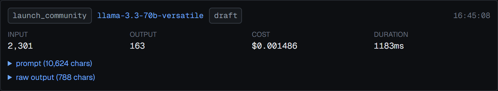

# 9. Model layer

[`src/lib/model/`](../src/lib/model/) — `types.ts`, `index.ts`, `groq.ts`,
`anthropic.ts`, `pricing.ts`, `ratelimit.ts`.

## The provider seam

```ts
export interface ModelProvider {
  id: string;
  complete(req: ModelRequest, apiKey: string): Promise<ModelResponse>;
  listModels(apiKey: string): Promise<string[]>;
}
```

Two implementations. Groq goes through its OpenAI-compatible endpoint with raw
`fetch`; Anthropic uses the official `@anthropic-ai/sdk`. Both normalise to the
same `ModelResponse`:

```ts
export type ModelResponse = {
  text: string;
  model: string;
  inputTokens: number | null;
  outputTokens: number | null;
  /**
   * Null when the model has no entry in the pricing table. Never guessed —
   * an unpriced call renders as "unpriced", not as $0.00 (SPEC section 4).
   */
  costUsd: number | null;
  durationMs: number;
  stopReason: string | null;
};
```

`stopReason` is kept verbatim because `runModelJson` uses it to distinguish a
truncated response from malformed JSON.

### JSON mode differs by provider, behaviour does not

Groq supports `response_format: { type: "json_object" }`. Anthropic has no
direct analogue, so the instruction goes in the system prompt:

```ts
const system = req.jsonMode
  ? `${req.system ?? ""}\n\nRespond with a single valid JSON object and nothing else. No prose, no markdown fences.`.trim()
  : req.system;
```

Either way, Zod validates the result and retries once. Validation is not
delegated to the provider, so behaviour is identical across both.

## Task routing

```ts
export type ModelTask = "compile" | "critique" | "draft" | "classify";

export const MODEL_CONFIG: Record<ModelProviderId, Record<ModelTask, string>> = {
  groq: {
    compile: "openai/gpt-oss-120b",
    critique: "openai/gpt-oss-120b",
    draft: "llama-3.3-70b-versatile",
    classify: "llama-3.1-8b-instant",
  },
  anthropic: {
    compile: "claude-opus-5",
    critique: "claude-opus-5",
    draft: "claude-sonnet-5",
    classify: "claude-haiku-4-5",
  },
};
```

A strong model for compilation and critique, a cheaper one for drafting and
classification. Changing which model does what is an edit to this object and
nowhere else — callers pass a task, never a model id.

`classify` is currently unused; no code path passes it. It exists because the
routing table is provider-shaped rather than call-site-shaped.

## The only way to call a model

`runModel` is the single entry point, and it logs unconditionally:

```ts
export async function runModel(input: RunModelInput): Promise<ModelResponse> {
  const resolved = await resolveModelKey(input.workspaceId);
  if (!resolved) throw new NoModelKeyError();

  const provider = getProvider(resolved.provider);
  const model = MODEL_CONFIG[resolved.provider][input.task];
  ...
  try {
    const response = await provider.complete({...}, resolved.key);
    await db.insert(agentRuns).values({
      jobId: input.jobId, agentId: input.agentId, model: response.model,
      prompt: promptForLog, rawOutput: response.text,
      inputTokens: response.inputTokens, outputTokens: response.outputTokens,
      costUsd: response.costUsd === null ? null : response.costUsd.toFixed(6),
      durationMs: response.durationMs,
      toolCalls: { task: input.task, stopReason: response.stopReason },
    });
    return response;
  } catch (e) {
    await db.insert(agentRuns).values({
      ...,
      rawOutput: `ERROR: ${message}`,
      toolCalls: { task: input.task, failed: true },
    });
    throw e;
  }
}
```

The failure path writes a row too — a failed call is the one you most want to
inspect. `jobId` is required, so every model call is attributable to a job.



Note the four measured figures — input tokens, output tokens, cost to six
decimal places, and duration — plus expandable prompt and raw output. The
`draft` badge is the task that routed the call.

## Cost accounting

```ts
export const PRICING: Record<string, Price> = {
  "claude-opus-5": { inputPerMTok: 5, outputPerMTok: 25 },
  "claude-sonnet-5": { inputPerMTok: 3, outputPerMTok: 15 },
  "claude-haiku-4-5": { inputPerMTok: 1, outputPerMTok: 5 },
  "llama-3.3-70b-versatile": { inputPerMTok: 0.59, outputPerMTok: 0.79 },
  "llama-3.1-8b-instant": { inputPerMTok: 0.05, outputPerMTok: 0.08 },
  "openai/gpt-oss-120b": { inputPerMTok: 0.15, outputPerMTok: 0.75 },
  "openai/gpt-oss-20b": { inputPerMTok: 0.1, outputPerMTok: 0.5 },
  "moonshotai/kimi-k2-instruct": { inputPerMTok: 1.0, outputPerMTok: 3.0 },
};

export function costOf(model, inputTokens, outputTokens): number | null {
  const price = PRICING[model];
  if (!price || inputTokens === null || outputTokens === null) return null;
  return (inputTokens / 1_000_000) * price.inputPerMTok
       + (outputTokens / 1_000_000) * price.outputPerMTok;
}
```

**A model with no entry returns `null`, not `0`.** The comment states the
reason:

```ts
/**
 * USD per million tokens. SPEC section 4 forbids fabricated numbers, so a model
 * absent from this table yields a null cost rather than zero — the UI then says
 * "unpriced" instead of implying the call was free.
 */
```

This propagates: the job inspector renders `unpriced` for a null cost, and the
per-job total is `null` rather than `0` when no call in the job was priced.

The table is hand-maintained and dated in the source comment. `unpricedTasks()`
exists so the UI can report which configured models lack a price, though no page
currently calls it.

## Rate limit handling

[`src/lib/model/ratelimit.ts`](../src/lib/model/ratelimit.ts) reads the
provider's own headers rather than guessing a delay:

```ts
export function recordLimits(model: string, headers: Headers): void {
  const remaining = headers.get("x-ratelimit-remaining-tokens");
  const reset = headers.get("x-ratelimit-reset-tokens");
  const limit = headers.get("x-ratelimit-limit-tokens");
  ...
}
```

Groq reports reset as a duration string — `7.66s`, `1m30s`, `2m59.56s` —
parsed by `parseResetDuration`.

Before each call, `waitForBudget` sleeps if the remaining budget cannot cover
the estimated need:

```ts
export async function waitForBudget(model, needed, onWait?): Promise<number> {
  const budget = budgets.get(model);
  if (!budget || budget.remainingTokens === null || budget.resetAt === null) return 0;
  if (budget.remainingTokens >= needed) return 0;

  const waitMs = Math.max(0, budget.resetAt - Date.now()) + 500;
  onWait?.(waitMs);
  await new Promise((r) => setTimeout(r, waitMs));
  budgets.delete(model);
  return waitMs;
}
```

`onWait` threads up through `runModel` into the job log, so a pause appears as
`rate limit: waiting 27s for openai/gpt-oss-120b` rather than looking like a
hang.

The Groq provider additionally retries:

| Status | Behaviour |
|---|---|
| 429 | Up to 4 attempts, waiting the provider's `retry-after` or reset header, default 15s |
| 500, 502, 503, 529 | Up to 4 attempts, exponential backoff 4s → 8s → 16s → 32s, capped at 60s |
| 413 | **Not retried.** Throws with a message saying the request exceeds the per-minute token limit |

The 5xx branch exists because Groq returned 503 "currently over capacity"
during development, with guidance to back off exponentially.

**Budget state is per-process and in-memory** (`const budgets = new Map(...)`).
It does not survive a restart and is not shared between serverless instances. On
a platform that spreads invocations across instances, each learns the limit
independently by hitting a 429 once.

Rate limits are also why the compile chain sends raw page text to only three of
nine stages — see [5](05-compile-chain.md).

## Key resolution

```ts
export async function resolveModelKey(workspaceId): Promise<{ key; source; provider } | null> {
  const row = await getSettings(workspaceId);
  const provider = (row?.modelProvider ?? "groq") as ModelProviderId;

  if (row?.encryptedModelKey) {
    try {
      return { key: decryptSecret(row.encryptedModelKey), source: "byok", provider };
    } catch {
      // Fall through to env rather than hard-failing.
    }
  }

  const fallbackVar = MODEL_PROVIDERS.find((p) => p.id === provider)?.envFallback ?? "GROQ_API_KEY";
  const fromEnv = getEnv()[fallbackVar];
  if (fromEnv && fromEnv.length > 0) return { key: fromEnv, source: "env", provider };
  return null;
}
```

BYOK first, environment second. A key that fails to decrypt — for example
because `APP_ENCRYPTION_KEY` differs between environments — falls through to the
env fallback rather than failing hard, and `/settings` reports the stored key as
`undecryptable` so the cause is visible.

## Switching providers

Three ways, in increasing permanence:

**1. Change the provider for the workspace.** `/settings` → provider dropdown,
then paste a key. `saveModelKey` writes both the encrypted key and
`settings.model_provider`. Routing follows automatically because
`MODEL_CONFIG[provider]` is keyed by it.

**2. Environment fallback.** Set `ANTHROPIC_API_KEY` and set the provider to
`anthropic` in settings. `resolveModelKey` picks up `envFallback` for that
provider.

**3. Add a provider.** Implement `ModelProvider`, add it to the `PROVIDERS` map
in `index.ts`, add a `MODEL_CONFIG` entry, add a `MODEL_PROVIDERS` entry in
[`src/lib/settings.ts`](../src/lib/settings.ts) with its key prefix and env
variable, extend the `ModelProviderId` union, and add pricing rows. Nothing
outside `model/` and `settings.ts` changes.

### Verifying access

`checkModelAccess` calls `listModels` against the resolved key and returns the
model ids the key can actually reach. During development this caught the fact
that configured models must exist on the account before a compile is attempted —
all four Groq entries in `MODEL_CONFIG` were confirmed reachable this way.

```ts
export async function checkModelAccess(workspaceId): Promise<
  | { ok: true; provider: string; source: "byok" | "env"; models: string[] }
  | { ok: false; error: string }
>
```

It is not currently called from any page.
