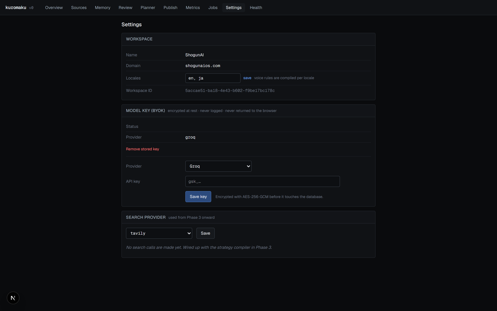
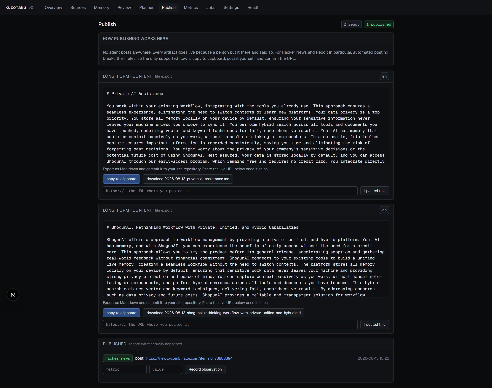

# 12. Security

## Threat model

v1 is a single-tenant internal tool with **no authentication**. Anyone who can
reach the deployment can read the memory, approve drafts, and mark work as
published. Every control described below assumes a trusted operator; none of
them defend against an untrusted one.

The controls that do exist protect against three things: leaking the model API
key, publishing without a human, and a crawler that misbehaves against someone
else's site.

## BYOK key encryption

[`src/lib/crypto.ts`](../src/lib/crypto.ts). AES-256-GCM with a versioned wire
format:

```
base64( [version:1][iv:12][authTag:16][ciphertext:n] )
```

```ts
export function encryptSecret(plaintext: string): string {
  if (plaintext.length === 0) throw new Error("Refusing to encrypt an empty secret");
  const iv = randomBytes(IV_LEN);
  const cipher = createCipheriv("aes-256-gcm", key(), iv);
  const ct = Buffer.concat([cipher.update(plaintext, "utf8"), cipher.final()]);
  const tag = cipher.getAuthTag();
  return Buffer.concat([Buffer.from([VERSION]), iv, tag, ct]).toString("base64");
}
```

Properties:

- **Random IV per encryption.** Encrypting the same key twice yields different
  ciphertext.
- **Authenticated.** GCM's auth tag is stored and verified; tampering with the
  stored envelope fails decryption rather than yielding garbage.
- **Versioned.** The leading byte allows a future scheme change without
  ambiguity. `decryptSecret` rejects an unknown version explicitly.
- **Length-checked.** A truncated envelope throws `Malformed secret envelope`
  rather than reading out of bounds.

The encryption key itself comes from `APP_ENCRYPTION_KEY` and is validated at
32 bytes:

```ts
.refine((v) => Buffer.from(v, "base64").length === 32,
  { message: "APP_ENCRYPTION_KEY must be 32 bytes encoded as base64" })
```

### Verified, not assumed

`npm run verify` writes a probe key, reads the raw column back, and asserts the
plaintext does not appear in it:

```ts
check(
  "Key is ciphertext at rest",
  Boolean(stored?.k) && !stored!.k!.includes(probe),
  `column holds a ${stored?.k?.length ?? 0}-char envelope, not the plaintext`,
);
```

Observed: a 72-character envelope for a 24-character key, with the plaintext
absent.

## What is never logged or returned

**The plaintext key never reaches the browser.** `getKeyStatus` returns a
discriminated union that cannot carry it:

```ts
export type KeyStatus =
  | { state: "none" }
  | { state: "env"; variable: string }
  | { state: "stored"; masked: string; updatedAt: Date }
  | { state: "undecryptable"; updatedAt: Date };
```

`masked` is fixed-width, so it does not leak length either:

```ts
export function maskSecret(plaintext: string): string {
  const tail = plaintext.slice(-4);
  return `${"•".repeat(8)}${tail}`;
}
```



Note the key renders as `••••••••` plus four characters. The screenshot script
additionally scans `/settings` for anything matching `gsk_…`, `tvly-…` or
`sk-ant-…` and **aborts the capture** rather than writing an image containing a
key.

**The key is not echoed on error.** The save action returns validation failures
without the submitted value:

```ts
if (!parsed.success) {
  // Never echo the submitted key back, even in an error.
  return { ok: false, message: parsed.error.issues[0].message };
}
```

**The key is not in provider error messages.** The Groq provider surfaces only
the message:

```ts
// The key must never reach a log line, so only the message is surfaced.
const detail = body.error?.message ?? res.statusText;
```

**The key is cleared from the DOM on submit:**

```tsx
action={(fd) => {
  action(fd);
  // Clear immediately so the plaintext key does not linger in the DOM.
  if (inputRef.current) inputRef.current.value = "";
}}
```

The input is `type="password"` with `autoComplete="off"`.

### What *is* logged

`agent_runs.prompt` stores the full prompt of every model call, and
`raw_output` stores the response. Those contain the compiled memory and the
source text — not secrets, but not nothing either. Anyone with database access
or access to `/jobs/<id>` can read them.

The API key is not among them: it travels in an `Authorization` header
constructed inside the provider, never in the prompt.

## Round-trip verification is a real decrypt

The settings screen reports the round trip by reading back from Postgres and
decrypting, rather than echoing what was submitted:

```ts
// Read back through the same path the app will use, so the UI reports an
// actual decrypt from Postgres rather than echoing what was submitted.
const status = await getKeyStatus(ws.id);
if (status.state !== "stored") {
  return { ok: false, message: "Key was written but could not be decrypted on read back" };
}
```

## The no-auto-publish enforcement point

**There is exactly one place an artifact becomes `published`**: `markAsPosted`
in [`src/lib/publish.ts`](../src/lib/publish.ts).

```ts
export async function markAsPosted(artifactId: string, externalUrl: string): Promise<void> {
  const url = externalUrl.trim();
  try {
    const parsed = new URL(url);
    if (parsed.protocol !== "https:" && parsed.protocol !== "http:") {
      throw new Error("bad protocol");
    }
  } catch {
    throw new Error(
      "That is not a valid URL. Publishing requires the real link so performance can be attributed to it.",
    );
  }

  const [artifact] = await db.select().from(artifacts).where(eq(artifacts.id, artifactId)).limit(1);
  if (!artifact) throw new Error("Artifact not found");
  if (artifact.status !== "approved") {
    throw new Error(`Only an approved artifact can be marked as posted. This one is ${artifact.status}.`);
  }

  await db.update(artifacts)
    .set({ status: "published", externalUrl: url, publishedAt: new Date() })
    .where(eq(artifacts.id, artifactId));
}
```

Three gates: a syntactically valid `http`/`https` URL, an artifact that exists,
and a status of exactly `approved`. A draft cannot skip review.

`markAsPosted` is reachable only from the `/publish` server action, which is
reachable only from a form submission. It is **not** exposed over REST or MCP —
see [10](10-api-and-mcp.md).

### No outbound platform writes exist

There is no code in the repository that authenticates against X, Hacker News,
Reddit, Product Hunt or LinkedIn. The only outbound HTTP is:

| Caller | Destination | Purpose |
|---|---|---|
| `ingest/fetch.ts` | The crawl target | `GET` only |
| `search/index.ts` | Tavily / Brave / Exa | Search queries |
| `model/groq.ts`, `model/anthropic.ts` | Model providers | Completions |
| `db/index.ts` | Neon | SQL over HTTP |

The publish UI states the constraint rather than leaving it implicit:



Note the "How publishing works here" panel and the per-channel instruction —
Hacker News and Reddit say explicitly that automated posting breaks their rules
and is not implemented.

## Crawler posture

[`src/lib/ingest/robots.ts`](../src/lib/ingest/robots.ts) and
[`fetch.ts`](../src/lib/ingest/fetch.ts).

**An unreadable robots.txt means disallowed, not permitted:**

```ts
if (!res.ok) {
  // A 404 or 410 is the normal "no rules" case.
  if (res.status === 404 || res.status === 410) {
    return { ..., status: `No robots.txt (HTTP ${res.status}) — no restrictions declared`, blocked: false };
  }
  return { ..., status: `Could not read robots.txt: ${res.error}. Treating as disallowed.`, blocked: true };
}
```

A 5xx or a network error blocks the crawl entirely. Only an explicit 404/410 is
read as "no rules".

**A declared crawl-delay is honoured**, clamped to a polite floor and a sane
ceiling:

```ts
crawlDelayMs: Math.min(Math.max((declaredDelay ?? 0.5) * 1000, 250), 10_000),
```

With no declared delay the default is 500 ms between requests.

**The user agent is honest and identifies the project:**

```ts
export const USER_AGENT = "KuromakuBot/0.1 (+https://github.com/gsaianimesh/kuromaku)";
```

**Per-request limits** live in one module so nothing else can fetch without
them: a 10-second timeout, a 2 MB body cap checked against both
`content-length` and the actual body, and rejection of non-text content types
before reading.

**The crawl is same-origin and bounded.** `crawlable()` rejects a different
origin and known binary extensions; the page cap defaults to 30; a
`budgetMs` of 45 seconds stops the loop.

### What the crawler does not do

- It does not respect `<meta name="robots">` or `X-Robots-Tag` — only
  `/robots.txt`.
- It does not rate-limit across concurrent crawls of the same host. Two
  workspaces crawling one domain would each apply their own delay
  independently. In a single-workspace deployment this cannot arise.

## Input validation surfaces

| Surface | Validation |
|---|---|
| Server actions | Zod on every `FormData` parse |
| REST bodies | Zod, `400` with issue messages on failure |
| MCP arguments | Hand-checked types, `isError: true` on mismatch |
| Job payloads | Zod inside the handler registry |
| Model output | Zod with one retry, then a stage failure |

SQL is parameterised throughout by Drizzle. The two raw `sql` fragments — the
claim query and the unsourced-count subquery — interpolate only Drizzle column
references, no user input.

## Known security gaps

Listed in full in [15 — Known limitations](15-known-limitations.md). The ones
that matter most:

- **No authentication on anything.** Deploying this publicly exposes the memory,
  the review queue and the ability to mark work published.
- **`/api/worker` is open when `CRON_SECRET` is unset**, which is the default.
- **No CSRF protection beyond Next.js server-action defaults**, and no rate
  limiting on any route.
- **Search API keys are unencrypted environment variables**, unlike the model
  key.
