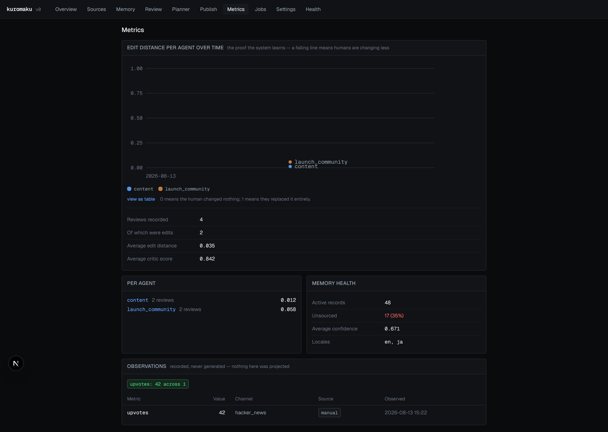

# 13. Testing and evaluation

There is **no unit test suite and no test runner**. No Jest, no Vitest, no
`*.test.ts` files. What exists instead is three executable scripts that assert
against a real database and, for two of them, real model calls.

That is a deliberate trade with real costs, discussed at the end of this
document and in [15 — Known limitations](15-known-limitations.md).

| Script | Command | Model calls | Runtime | Asserts |
|---|---|---|---|---|
| [`scripts/verify.ts`](../scripts/verify.ts) | `npm run verify` | No | ~2–4 min | Infrastructure invariants |
| [`scripts/e2e.ts`](../scripts/e2e.ts) | `npm run e2e` | Yes | ~5–15 min | The full pipeline |
| [`scripts/eval.ts`](../scripts/eval.ts) | `npm run eval` | Yes | ~5–10 min | Model output behaviour |

All three require a working `.env.local` and an applied migration. `e2e` and
`eval` additionally require a model key.

---

## `npm run verify`

Infrastructure acceptance checks. No model calls, so it is the one to run after
a schema or queue change.

**Phase 0 — scaffold**
- Environment variables present and well formed
- Database reachable, `select version()`
- Migrations applied, 13/13 expected tables present
- AES-256-GCM encrypt → decrypt round trip
- Workspace bootstrap
- A stored key is ciphertext at rest, with the plaintext absent from the column
- A key survives encrypt → Postgres → decrypt with a matching tail

**Phase 1 — schema and jobs**
- All SPEC section 6 tables exist
- Enqueuing the same idempotency key twice creates one job
- Two concurrent `claimNext()` calls take different rows
- Claiming sets `running` and increments `attempts`
- The worker claims, runs and completes
- A throwing job requeues with backoff and retains its error
- Exhausting `maxAttempts` marks it failed
- A failed job releases its idempotency key
- An unregistered job type fails with a readable message
- A job whose worker died is recovered rather than stranded

**Phase 2 — ingestion**
- Sources exist with URL, extracted text and a 64-character hash
- Content hashes are unique per workspace
- Re-crawling stores nothing and matches unchanged pages
- robots.txt was read and respected
- Query spellings normalise to one cache key
- A completed job releases its key, so work can re-run

### It is non-destructive

Any pre-existing BYOK key is snapshotted and restored in a `finally`, and every
job it creates is prefixed and deleted at the end:

```ts
const PREFIX = `verify-${Date.now()}-`;
...
const removed = await db.delete(jobs)
  .where(like(jobs.idempotencyKey, `${PREFIX}%`))
  .returning({ id: jobs.id });
```

### The re-crawl is capped

```ts
/*
 * Capped to a few pages deliberately. Proving the dedup only needs pages
 * that are already stored to come back as unchanged; refetching the whole
 * site to prove it turns the fast check into a multi-minute one, and it is
 * hostage to how quickly the target responds.
 */
maxPages: 3,
budgetMs: 30_000,
```

Even so, `verify` still makes live HTTP requests to the crawl target. It is not
hermetic and will fail if that site is down.

---

## `npm run e2e`

Walks the definition of done against real model calls.

1. **Re-compile supersedes rather than duplicating** — asserts superseded rows
   exist, active count has not ballooned, and superseded rows carry a
   `supersedes_id`. Runs two compiles only when memory is empty; otherwise it
   asserts against the state a previous compile left, because a compile costs
   ~10 minutes.
2. **Provenance** — every record has a source or an unsourced flag; no unsourced
   record has confidence ≥ 0.5.
3. **Planner** — schedules jobs with readable reasons; a prioritised channel
   with no agent becomes a gap.
4. **Agent** — the run completes; a draft appears with evidence; it carries a
   critic score; evidence resolves to real records or URLs.
5. **Review** — editing records a normalised distance; the dashboard has an
   average.
6. **Publish** — marking as posted requires and stores a real URL; an
   observation is recorded.
7. **The plan changes** — a channel with two recent artifacts and no
   observations is skipped, with the reason recorded.
8. **Staleness** — editing a cited record marks derived artifacts stale and
   creates a successor.
9. **Cost logging** — model calls are logged with tokens and cost.

### Last full run

15/15 passed. Selected evidence:

| Check | Observed |
|---|---|
| Supersede | 48 active, 52 superseded, max version 3 |
| Unsourced cap | max confidence among unsourced: **0.40** |
| Coverage gaps | `reddit` (rank 4), `linkedin` (rank 5) |
| Draft | 4 evidence items, critic 0.95 |
| Edit distance | 0.0580 |
| Observation gate | *"2 artifact(s) in the last 14 days and no observations recorded for any of them."* |
| Staleness | 1 artifact marked stale, 1 successor record |
| Cost | 3 runs, 3 priced, $0.0039 |

The results of those checks are visible in the UI rather than only in the
script's output:



Note the "Memory health" panel — active records, unsourced count and proportion,
average confidence — which is the same data the `e2e` provenance checks assert
against, and the observations table below, which is what the planner reads.

### It mutates the database

Unlike `verify`, `e2e` leaves its changes in place: it approves and edits real
artifacts, publishes one, records an observation, and edits a memory record.
It also deletes prior `run_agent` jobs and artifacts before the planner check,
because otherwise the planner correctly returns already-scheduled jobs and the
check misreads that as having scheduled nothing.

Run it against a database you are willing to have modified.

---

## `npm run eval`

The golden set: [`eval/golden.ts`](../eval/golden.ts), runner
[`scripts/eval.ts`](../scripts/eval.ts).

### It departs from the specification, deliberately

The spec asks for "20 fixed prompts with reference outputs". The golden set has
20 fixed prompts and **no reference outputs**. The reasoning is in the file
header:

```ts
/**
 * A deliberate departure from the spec's wording, flagged rather than done
 * silently: the spec asks for "20 fixed prompts with reference outputs", but
 * exact-match reference outputs are meaningless for open-ended drafting — the
 * same prompt legitimately produces different text every run, so a diff against
 * a fixed string measures nothing but temperature.
 */
```

Instead each case pairs a fixed input with assertions over the output.

### The fixtures

A small invented company, `Kagi Notes`, defined inline in `scripts/eval.ts` as
`FIXTURE_SOURCES` and `FIXTURE_MEMORY`. Nothing about the workspace's real data
affects the result, so the eval is stable across compiles.

Stage prompts come from the real `systemPromptFor(stage)`, so a change to a
production prompt is what the eval is testing.

### The assertions

| Assertion | What it catches |
|---|---|
| `parses as JSON` | Output shape regressions |
| `has records[]` | Envelope regressions |
| `every record is addressable` | A record with no key cannot supersede |
| `confidence within 0..1` | Out-of-range or non-numeric confidence |
| `cites a source or declares low confidence` | **An uncited record claiming ≥ 0.5** |
| `no fabricated metrics` | Invented counts, multiples, percentages, latency |
| `no confident rule for an unsourced locale` | Translated voice rules presented as observed |
| `cites no threads when none were given` | Invented thread URLs |
| `scores hype below threshold` | A critic that waves through obvious hype |

The fabricated-metric check is a regex battery over the raw output:

```ts
const patterns: Array<[RegExp, string]> = [
  [/\b\d{1,3}(,\d{3})+\s*(users|customers|downloads|installs|developers)\b/i, "a user/customer count"],
  [/\b\d+(\.\d+)?\s*(x|times)\s+(faster|better|more)\b/i, "a performance multiple"],
  [/\b\d+(\.\d+)?%\s*(faster|more|better|increase|improvement|growth)\b/i, "a percentage improvement"],
  [/\btrusted by\s+\d/i, "a social-proof count"],
  [/\b\d+(\.\d+)?\s*(ms|milliseconds)\s+(latency|response)\b/i, "a latency claim"],
];
```

The critic case is the one negative test: a draft stuffed with *"trusted by
50,000 developers"*, *"10x faster"* and *"95% improvement"* must score **below**
0.7. A critic that scores it highly fails the run.

### Call deduplication

Several cases assert different things about the same output. The runner caches
by `task + system + user`, so 20 cases cost roughly 12 model calls.

Every eval call is logged to `agent_runs` against a dedicated `eval_run` job, so
eval cost appears in the same place as production cost.

---

## What is not covered

This is the honest list.

**No unit tests.** Nothing tests `normalisedEditDistance`, `parseResetDuration`,
`slugify`, `canonicalise`, `extract` or the envelope normaliser in isolation.
These are pure functions with edge cases — the exact things a unit test is good
at — and they are only exercised incidentally.

The cost of this is documented: the query-normalisation bug that let
`"alternatives? "` and `"alternatives"` produce different cache keys survived
until a search API key made the integration check runnable. A three-line unit
test would have caught it immediately. A regression check now exists in
`verify`, but it was added *after* the bug, not before.

**No UI tests.** No component tests and no interaction tests. Playwright is
installed but used only for screenshots. The server actions — approve, edit,
reject, mark-as-posted, record-observation — are exercised through their library
functions in `e2e`, never through the form path.

**No concurrency tests beyond one.** Two concurrent `claimNext()` calls are
tested. Two concurrent compiles, two workers racing on the same job, and the
window in `writeRecord` where two rows are briefly `active` are not.

**No failure-injection tests.** Provider 5xx handling, the retrying fetch, and
stale-lock recovery under a genuinely killed worker are implemented and were
observed working during development, but nothing exercises them deterministically.

**Nothing is hermetic.** `verify` hits the live crawl target; `e2e` and `eval`
hit a live model provider. All three require a live Neon database. There are no
fixtures, no seeded test database, and no CI configuration — none of these can
run in a pipeline without credentials and network access.

**No load or performance testing.** The largest workspace tested has 8 sources
and 48 memory records.
