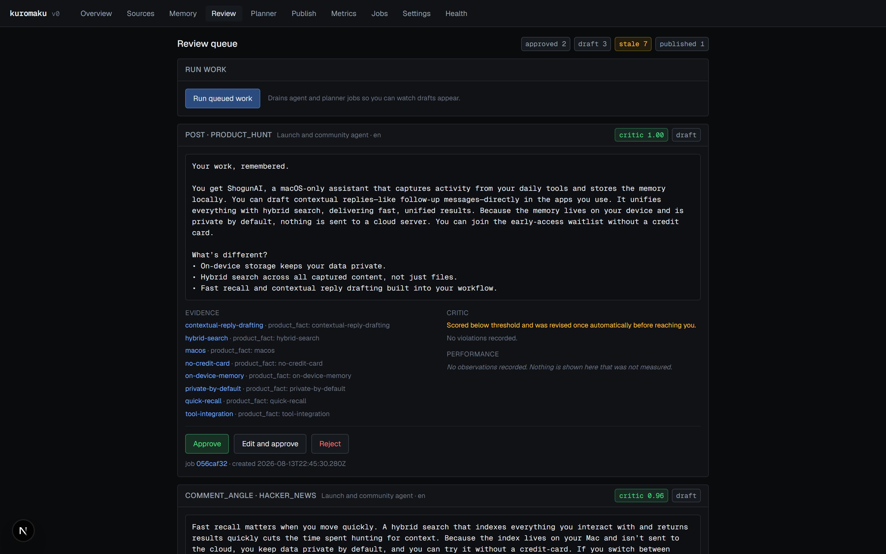
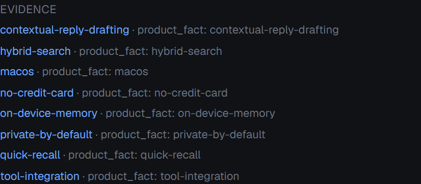
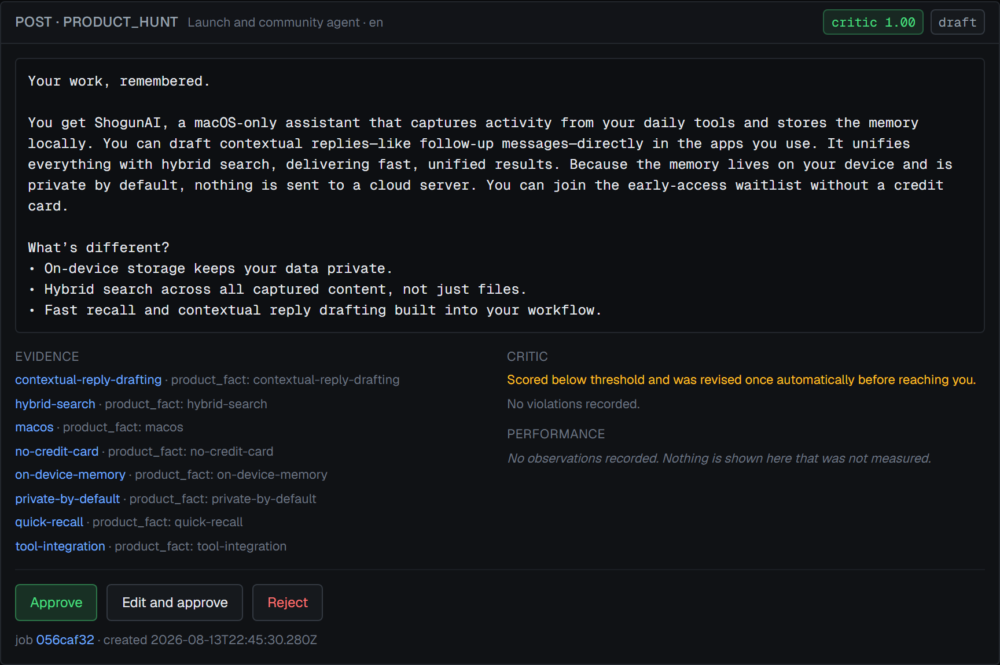
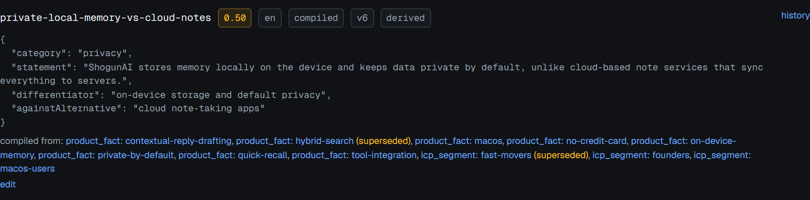
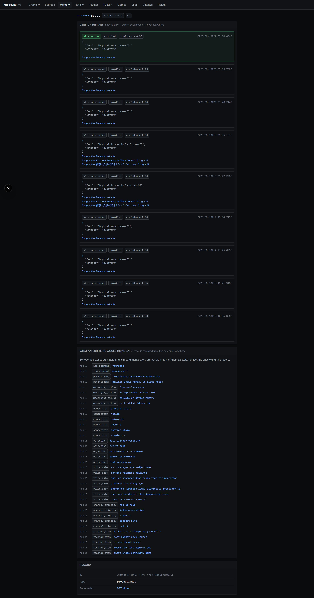
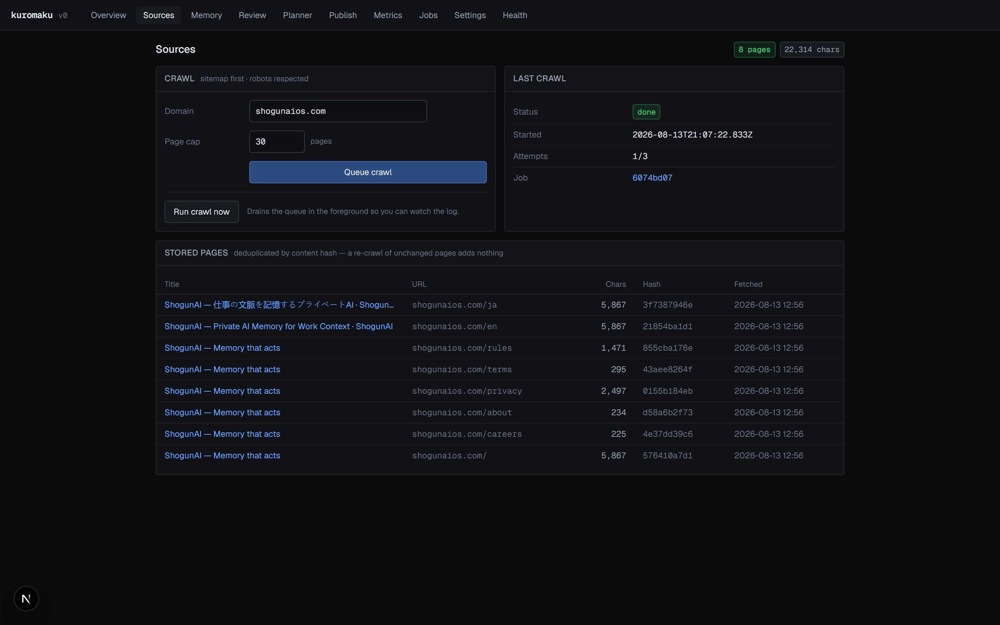
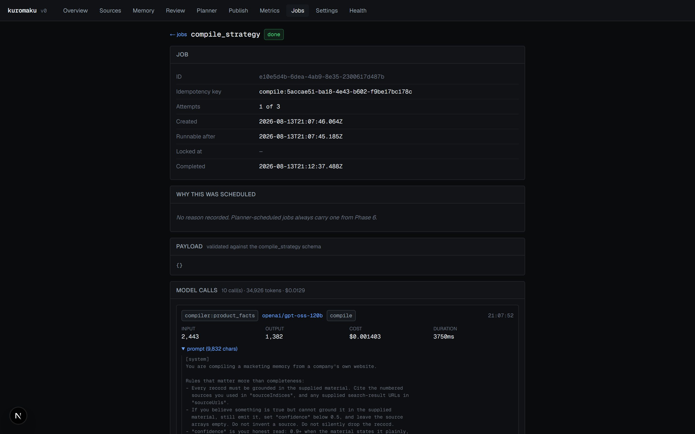

# 14. Runbook

## Tracing a bad draft back to its origin

The chain is: **draft → evidence → memory record → version history → source
page**. Every hop is a link in the UI.

### 1. Start at the draft

`/review`. Read the content, then the evidence panel beside it.



Note the status counts along the top. An artifact badged `stale` is the first
thing to look at — its content may be fine while the memory beneath it has
moved.



Note that each evidence item is a link. Memory record ids resolve to
`/memory/<id>`; source URLs open the page. The trailing note says what the item
is — `icp_segment: founders`, or a runner-attributed note if the model did not
name its own sources.

Three shapes of evidence and what each tells you:

| Evidence item | Means |
|---|---|
| `key` linked, note `type: key` | The model named this record |
| `key` linked, note ends *"(attributed by the runner — the model did not name its sources)"* | The model named nothing; the runner attributed positioning and ICP |
| No link, note *"No discussion search was possible: …"* | The draft rests on memory alone; no thread was cited because none could be found |

The third case is the most common cause of a vague community draft: with no
search provider configured, the agent has no real discussion to respond to.

### 2. Check the critic before blaming the memory



Note the violation names the rule, quotes the offending text, and carries a
severity. If the critic already caught the problem and the draft still reads
badly, the issue is the threshold or the revision, not the memory.

If `critic_notes.revisedAutomatically` is true, the text you are reading is the
*revised* version — the original is not stored separately.

### 3. Follow evidence into the memory

Click a record key and read how it accounts for itself. A `sourced` record links
the page it came from. A `derived` record names the records it was compiled from,
each a link, so the trail continues upward.



An `unsourced` badge is the one to worry about: nothing in the system accounts
for that record, its confidence reads `0.40` because that is the cap applied at
write time rather than a value the model chose, and a draft built on it is
resting on an ungrounded inference. On the seeded workspace there are none — see
[04 — Grounding](04-memory-semantics.md#grounding-three-states-not-two).

### 4. Read the version history

`/memory/<id>` → the full chain.



Note the `origin` badge per version. A record whose active version is `human`
was corrected by hand; one at `compiled` v3 has been rewritten by three separate
compiles, which may indicate an unstable extraction.

### 5. Read the source

Click the source link on any sourced version to open the crawled page, or go to
`/sources/<id>` for the exact extracted text the compiler saw — not the live
page, which may have changed.



Note the `Chars` and `Hash` columns. A source with very few characters is
probably a client-rendered page whose content the crawler never saw.

### The same trace over the API

```bash
# Evidence for a draft, including which records are superseded
curl 'localhost:3000/api/v1/artifacts?status=draft' | jq '.artifacts[0].evidence'

# The record it cites
curl 'localhost:3000/api/v1/memory' | jq '.records[] | select(.key=="founders")'
```

---

## Inspecting a failed job

`/jobs` → find the job → **inspect**.



Read in this order:

1. **Attempts** — `2/3` means one retry remains; `3/3` with status `failed` is
   terminal.
2. **Runnable after** — a `queued` job with attempts > 0 shows *held for retry
   backoff*. It is not stuck; it is waiting.
3. **Error** — retained across retries. On a `queued` job it is from the
   previous attempt.
4. **Model calls** — the panel header gives call count, total tokens and total
   cost. Expand `prompt` and `raw output` on the last call.

For a compile that failed validation, the last `agent_runs` row holds the exact
malformed output the model returned. That is the fastest way to tell a prompt
problem from a truncation problem.

```sql
-- The failing call for a job, with its raw output
SELECT agent_id, model, input_tokens, output_tokens, cost_usd,
       left(raw_output, 500) AS output_head
FROM agent_runs
WHERE job_id = '<job-id>'
ORDER BY created_at DESC
LIMIT 1;
```

---

## Failure modes

### 1. Compile fails with a truncated stage

**Symptom.** Job `failed`. Error names a stage and says the model did not return
usable JSON after two attempts. The last `agent_runs` row for that stage has
`output_tokens` exactly equal to `STAGE_MAX_TOKENS` (2500) and `raw_output` ends
mid-token.

**Cause.** The stage emitted many records with long snippets and hit the output
cap. Historically the retry then made it worse — being told "that was not valid
JSON" it returned the same too-long answer, and the extra tokens starved the
per-minute budget.

**Fix already in place.** `runModelJson` distinguishes the two:

```ts
const truncated =
  response.stopReason === "length" || response.stopReason === "max_tokens";

lastProblem = truncated
  ? `the response was cut off at the ${input.maxTokens ?? 8000} token limit, so the JSON is incomplete. Return fewer records and keep every snippet under 150 characters.`
  : `not valid JSON (…)`;
```

**If it recurs.** Lower the per-stage record ceiling in the `COMMON` preamble in
[`src/lib/compile/stages.ts`](../src/lib/compile/stages.ts) (currently "at most
8 records"), or raise `STAGE_MAX_TOKENS` — but check the model's tokens-per-minute
limit first, because raising it costs budget on every call.

**Recovery.** Re-run the compile. Records from stages that succeeded are already
committed and will be superseded rather than duplicated.

### 2. Everything stalls on rate limits

**Symptom.** A job appears to hang. The log shows repeated
`rate limit: waiting 38s for openai/gpt-oss-120b`. Wall time per compile runs to
several minutes.

**Cause.** Not a bug. The free Groq tier caps `gpt-oss-120b` at 8,000 tokens per
minute, and one compile stage can consume most of a minute's budget.

**Confirm it:**

```bash
curl -sI -X POST https://api.groq.com/openai/v1/chat/completions \
  -H "authorization: Bearer $GROQ_API_KEY" -H 'content-type: application/json' \
  -d '{"model":"openai/gpt-oss-120b","messages":[{"role":"user","content":"hi"}],"max_tokens":1}' \
  | grep -i ratelimit
```

**Options.** Route `compile` to a model with a higher limit in `MODEL_CONFIG` —
`llama-3.3-70b-versatile` reports 12,000 TPM against the same key. Or reduce
`SOURCES_CHAR_BUDGET`. Or accept the wall time and run compiles locally rather
than through the 60-second worker route
([11](11-configuration-and-deployment.md)).

### 3. A job is stuck in `running`

**Symptom.** `/jobs` shows `running` and nothing progresses.

**Cause.** The process holding it died — killed, crashed, or a serverless
invocation timed out.

**Automatic recovery.** `recoverStaleJobs()` runs at the start of every worker
invocation and reclaims anything `running` with `locked_at` older than five
minutes, routing it through `failJob` so it re-queues with backoff if attempts
remain. The 5-minute cron is therefore the recovery mechanism.

**Manual recovery**, when you do not want to wait:

```sql
UPDATE jobs
SET status = 'failed', locked_at = NULL,
    error = 'Manually released: the worker holding this job died.'
WHERE status = 'running' AND id = '<job-id>';
```

**Watch out.** A job that legitimately runs longer than `STALE_LOCK_MS` will be
reclaimed while still executing, producing two concurrent runs. If you have
raised `maxDuration`, raise `STALE_LOCK_MS` to match.

### 4. `fetch failed` from Neon

**Symptom.** A page render or a script dies with
`Error connecting to database: TypeError: fetch failed`.

**Cause.** A transport-level failure reaching Neon's HTTP endpoint. Observed
three times during development on one machine, alongside TLS interception of
other hosts — environmental rather than a driver defect.

**Mitigation in place.** `getDb()` installs a retrying fetch:

```ts
/**
 * Only a *thrown* fetch is retried, never an HTTP error response: a throw means
 * no response headers ever arrived, so the query almost certainly never reached
 * Postgres. …Two retries with short backoff is the deliberate trade: the failure
 * being fixed is common and total, the one being risked is rare and partial.
 */
```

**If it persists past that**, the network is dropping three times inside ~450 ms.
Check connectivity to the Neon host directly and confirm nothing is intercepting
TLS.

### 5. The competitors stage produces nothing

**Symptom.** No `competitor` records, or all of them unsourced. The compile log
shows `search "…": unavailable — No API key for tavily`.

**Cause.** No search provider key. This is designed behaviour, not a failure:
the stage refuses to invent competitor names.

**Fix.** Set `TAVILY_API_KEY` (or `BRAVE_API_KEY` / `EXA_API_KEY`, matching
`settings.search_provider`) and re-compile.

**Consequence if left unfixed.** The content agent cannot produce a comparison
page — it throws:

```ts
if (wantsComparison && competitors.length === 0) {
  throw new Error(
    "A comparison page needs competitor records, and none are in memory. Configure a search provider and re-compile, or request a long-form piece instead.",
  );
}
```

### 6. The planner schedules nothing

**Symptom.** "Run planner now" reports zero scheduled.

**Three causes, in order of likelihood:**

1. **Jobs already exist for today.** The key is day-bucketed
   (`agent:{ws}:{agent}:{channel}:{YYYY-MM-DD}`), so a second run returns
   existing jobs and records them under `skipped`, not `scheduled`. Check the
   planner output for skip reasons.
2. **Every prioritised channel is gated** by the observation rule. The skip
   reason names it explicitly.
3. **No channel priorities in memory.** The log says
   `no channel priorities in memory — compile the strategy first`.

**Diagnose:**

```sql
SELECT key, value->>'channel' AS channel, value->>'rank' AS rank
FROM memory_records
WHERE type = 'channel_priority' AND status = 'active'
ORDER BY (value->>'rank')::int;
```

---

## Useful queries

```sql
-- Unsourced records, worst confidence first
SELECT type, key, confidence, locale
FROM memory_records m
WHERE status = 'active'
  AND NOT EXISTS (SELECT 1 FROM record_sources r WHERE r.record_id = m.id)
ORDER BY confidence DESC;

-- The version chain for one key
SELECT version, status, origin, created_at, supersedes_id
FROM memory_records
WHERE key = 'founders' AND type = 'icp_segment'
ORDER BY version;

-- Artifacts whose evidence points at superseded memory
SELECT a.id, a.channel, a.status, m.key AS stale_record
FROM artifacts a
JOIN artifact_evidence e ON e.artifact_id = a.id
JOIN memory_records m ON m.id = e.memory_record_id
WHERE m.status = 'superseded';

-- Spend by job
SELECT j.type, count(ar.id) AS calls,
       sum(ar.input_tokens + ar.output_tokens) AS tokens,
       sum(ar.cost_usd) AS cost
FROM jobs j JOIN agent_runs ar ON ar.job_id = j.id
GROUP BY j.type ORDER BY cost DESC NULLS LAST;

-- Research cache: what has been searched, and never search it twice
SELECT normalised_query, provider, created_at,
       jsonb_array_length(result) AS results
FROM research_cache ORDER BY created_at DESC;
```

## Health first

`/health` and `/api/health` check environment, connectivity, migration state and
the encryption round trip, and return `503` when any fails. Before debugging
application behaviour, confirm health is green — it distinguishes a
configuration problem from a logic one in one request.
