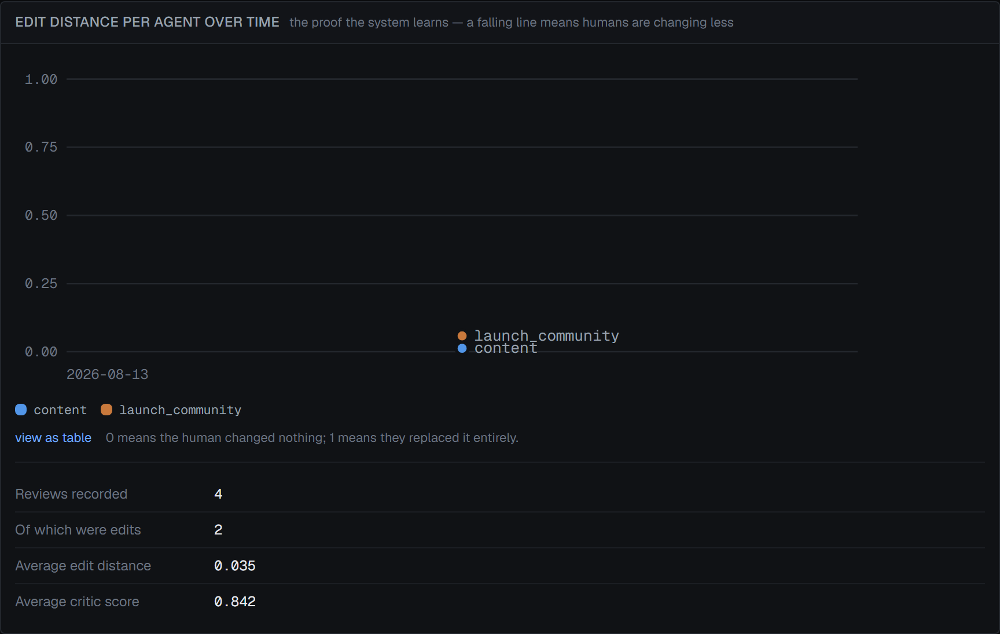

# 15. Known limitations and next steps

Everything the specification describes that is not implemented, every shortcut
taken, and what would come next.

---

## Not implemented

### Google Search Console

SPEC 7.9 describes "an optional Google Search Console read only connection".
**Not implemented.** No OAuth flow, no API client, no sync job. The
`observation_source` enum contains `gsc` and nothing writes it. Observations
arrive manually through `/publish` or over `POST /api/v1/observations`, which
records `source: "import"`.

### GitHub pull requests for blog content

SPEC 7.8 offers "optionally a GitHub pull request for blog content". **Not
implemented.** Markdown export exists at `/api/artifacts/{id}/export`; there is
no repository integration.

### The three-pane layout

SPEC section 8 asks for "three panes: memory on the left, work in the centre,
agents and jobs on the right". **Not implemented.** The UI is one pane per
route with a top nav. The information is all present and dense, but the layout
is not what the spec describes.

### `settings.model_config`

The column exists because SPEC section 6 names it. **Nothing writes or reads
it.** Task routing is the `MODEL_CONFIG` constant in
[`src/lib/model/index.ts`](../src/lib/model/index.ts), which cannot be changed
without a deploy.

### The `classify` task

`MODEL_CONFIG` routes a `classify` task to a cheap model. **No code path uses
it.** SPEC section 5 mentions "routine drafting and classification"; only
drafting is implemented.

### `source_kind` beyond `page`

The enum has `page`, `search_result` and `human`. Only `page` is ever written.
Search results live in `research_cache` and are cited by URL on
`record_sources`, never promoted to `sources` rows.

### Per-locale agent runs

Workspaces declare locales and voice rules compile per locale, but the planner
hard-codes `locale: "en"` on every job it schedules. Japanese voice rules are
compiled and never used.

---

## Shortcuts and their consequences

### One active memory record per key is not enforced by the database

The invariant "at most one `active` row per `(workspace_id, type, key, locale)`"
is maintained by application code in two places. Nothing stops a third write
path, a direct SQL insert, or two concurrent compiles from producing duplicates.

A partial unique index would fix it:

```sql
CREATE UNIQUE INDEX memory_records_active_uq
  ON memory_records (workspace_id, type, key, locale)
  WHERE status = 'active';
```

It is not present because `writeRecord` inserts the new row *before* superseding
the old one, so both are briefly active and the index would reject the insert.
Fixing it properly means reordering into a transaction — which the Neon HTTP
driver cannot express (see below). **This is the most significant correctness
gap in the system.**

### There are no transactions

The Neon HTTP driver runs every statement in its own implicit transaction. Three
multi-statement operations are therefore not atomic:

| Operation | Window |
|---|---|
| `writeRecord` | Insert new version → update old to superseded |
| `editRecord` | Insert → supersede → insert provenance → mark artifacts stale |
| Artifact persistence | Insert artifact → insert evidence rows |

A crash mid-sequence leaves inconsistent state: a record with two active
versions, a human edit with no provenance row, or an artifact with no evidence
despite the runner's check.

Switching to the WebSocket driver (`@neondatabase/serverless` `Pool`) would
allow real transactions and let the claim query return to the conventional
`SELECT … FOR UPDATE` + `UPDATE` shape. That is the single highest-value
refactor available.

### `agent_runs` cascade-deletes with its job

```ts
jobId: uuid("job_id").notNull().references(() => jobs.id, { onDelete: "cascade" }),
```

Deleting a job destroys its model-call audit trail. This is not theoretical — a
cleanup during development removed 19 of 22 `agent_runs` rows, and with them the
cost history.

Given SPEC section 4 requires every model call to be logged and inspectable,
`ON DELETE SET NULL` with a nullable `job_id`, or an archival table, would be
more appropriate.

### Staleness propagates exactly one hop

An artifact goes stale when a record it *directly* cites is superseded. Memory
records do not record derivation edges between themselves, so editing a
`product_fact` does not mark the `positioning` record that was compiled from it
stale — even though the compiler passed that fact into the positioning prompt.

The information exists at compile time. Recording it would mean a
`record_derivations` table written by `compileWorkspace`, and a recursive walk
in `editRecord`. This is a genuine gap in the central claim of the system.

### The compile summary is not persisted

`CompileSummary` — per-stage emitted, sourced, unsourced, superseded counts —
exists only in the job log as text. It cannot be queried, so "how has the
unsourced ratio moved across compiles" is unanswerable without parsing logs.

### Rate-limit state is per-process

`budgets` in [`ratelimit.ts`](../src/lib/model/ratelimit.ts) is a module-level
`Map`. It does not survive a restart and is not shared across serverless
instances, so each instance learns a limit by hitting a 429 once.

### `STALE_LOCK_MS` and `maxDuration` can conflict

Stale-lock recovery reclaims a job after five minutes. A compile takes longer
than that. If a compile is ever run through `/api/worker` with a raised
`maxDuration`, the recovery sweep will reclaim it mid-flight and run it twice
concurrently. The two constants must be kept in a fixed relationship and nothing
enforces that.

### The critic's original draft is discarded

When the critic revises below threshold, `artifacts.content` holds the *revised*
text. The pre-revision draft is not stored, so the critic's own effect cannot be
measured — only the human's, via edit distance.

### Evidence attribution is best-effort

When a model does not name the memory keys it used, the runner attributes
positioning and ICP records and labels them as runner-attributed. Honest, but it
means the evidence graph — which staleness depends on — is partly guessed.

### No pagination anywhere

`listArtifacts` caps at 100, `listSources` at 200, `listJobs` at 50,
`listObservations` at 100. There is no pagination in the UI or the API. A
workspace exceeding those limits silently sees a truncated view.

### Search keys are unencrypted

The model key is AES-256-GCM encrypted per workspace. Search keys are plain
environment variables. The asymmetry is defensible — BYOK in the spec is about
the model key — but it is an asymmetry.

### `/api/worker` is open by default

`CRON_SECRET` is optional. Unset, anyone can drain the queue. The route says so
in a comment; nothing enforces it in production.

### No authentication at all

Covered in [12 — Security](12-security.md). Worth repeating: this must not be
deployed publicly as-is.

### Testing gaps

No unit tests, no UI tests, no CI, nothing hermetic. Covered in
[13 — Testing and evaluation](13-testing-and-evaluation.md). The cost was
concrete: a query-normalisation bug that broke research deduplication survived
until an integration path made it visible.

### The chart cannot yet show a trend

The edit-distance chart is the stated proof that the system learns. With two
reviews recorded on a single day it renders two points and no line.



Note both series sit on the same date, so there is no slope to read. The chart
is correct — it does not zero-fill or interpolate — but the claim it exists to
support needs weeks of data the system has not yet accumulated.

---

## What I would build next

In order.

### 1. Move to the WebSocket driver and get transactions

Unblocks the active-record unique index, makes `editRecord` atomic, and lets the
claim query use the conventional shape. Everything below is easier afterwards,
and the correctness gaps above mostly disappear.

### 2. Record derivation edges between memory records

A `record_derivations` table written during compile, and a recursive walk in
`editRecord`. Today the system claims "editing a memory record invalidates what
came from it" and delivers that only for artifacts. Making it true for records
too closes the gap between the claim and the implementation.

### 3. Make the compiler resumable

Stages already commit independently. Adding a `compile_stage_runs` table and
skipping stages whose records already exist at the current source version would
turn a ten-minute all-or-nothing job into restartable work — which fixes the
serverless timeout problem properly rather than working around it.

### 4. Persist the compile summary

A `compile_runs` table with per-stage counts. Cheap, and it makes memory quality
a trend rather than an anecdote: unsourced ratio over time is the single best
indicator of whether the crawl and the prompts are improving.

### 5. Unit tests for the pure functions

`normalisedEditDistance`, `parseResetDuration`, `slugify`, `canonicalise`,
`normaliseQuery`, `extract`, `normaliseEnvelope`. All pure, all edge-case-heavy,
all currently untested. This is where the bugs have actually been.

### 6. Authentication, then multi-tenancy

Every table already carries `workspace_id`, so this is a routing and session
change rather than a migration. Auth first, because everything else is unsafe to
expose without it.

### 7. Google Search Console

The observation path exists and the planner already consumes observations. GSC
would make the loop close without a human typing numbers, which is the
difference between a demonstrable feedback loop and a used one.

### 8. Two more agents, chosen from the actual gaps

`reddit` and `linkedin` are the channels the compiler ranked and the registry
cannot serve. Writing them is a day's work each given the contract
([6](06-agents.md)), and it would demonstrate the extension path on channels the
system itself identified rather than ones chosen in advance.
